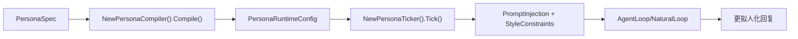

# Zapry Agents SDK for Go（中文文档）

用于构建 Zapry/Telegram Agent 的 Go SDK。  
它同时提供：

- **通道层能力**：消息收发、路由、中间件、生命周期；
- **Agent 智能层能力**：工具调用、ReAct 循环、记忆、护栏、追踪；
- **拟人化能力**：对话状态跟踪、情绪识别、风格后处理、开场策略、上下文压缩、**人设状态机（Persona Tick）**。

---

## 版本信息与优雅关闭（P2 新增）

### 查看 SDK 版本信息

```go
info := agentsdk.GetVersionInfo()
// info.Version / info.GitCommit / info.BuildTime
```

`Version`、`GitCommit`、`BuildTime` 支持在构建时通过 `-ldflags -X` 注入。

### 统一优雅关闭

```go
rt := &agentsdk.SDKRuntime{
	AutoConversation:   autoRuntime, // 可选
	ProactiveScheduler: scheduler,   // 可选
	MCPManager:         mcpManager,  // 可选
	MemoryStore:        memoryStore, // 可选（若实现 io.Closer 会自动关闭）
}
_ = rt.Shutdown(context.Background())
```

## 文档目标

这份 README 聚焦 4 件事：

1. 中文化说明（能中文就中文）；
2. 讲清 SDK 功能特性（含人设状态机）；
3. 每项功能都给出可落地用法；
4. 给出下一步演进计划（5 条建议）。

---

## 0. 开发者 5 分钟上手（推荐路径）

如果你是第一次接入，请先按下面 5 步做，其他高级能力先不看：

1. 安装依赖并准备 `.env`；
2. `NewAgentConfigFromEnv()` + `NewZapryAgent()`；
3. `BuildProfileSourceFromDir()` + `SetProfileSource()`；
4. 启用 `EnableAutoConversation(...)`（记忆/自然对话/人设状态默认自动托管）；
5. 按业务需要补充 `AddCommand`，然后 `Run()`。

### 0.1 最小可运行代码（L0）

```go
package main

import (
	"context"
	"log"

	agentsdk "github.com/cyberFlowTech/zapry-agents-sdk-go"
)

func main() {
	cfg, err := agentsdk.NewAgentConfigFromEnv()
	if err != nil {
		log.Fatal(err)
	}

	agent, err := agentsdk.NewZapryAgent(cfg)
	if err != nil {
		log.Fatal(err)
	}

	source, err := agentsdk.BuildProfileSourceFromDir(".", "demo-agent")
	if err != nil {
		log.Fatal(err)
	}
	agent.SetProfileSource(source)

	// 接你自己的模型网关（推荐使用带 context 的 LLMFnCtx）
	llmFnCtx := func(ctx context.Context, messages []map[string]interface{}, tools []map[string]interface{}) (*agentsdk.LLMMessage, error) {
		return &agentsdk.LLMMessage{Content: "（示例）这里替换为你的模型回复"}, nil
	}

	// 一次启用：记忆 + 自然对话 + 人设状态机自动托管
	_, err = agentsdk.EnableAutoConversation(agent, agentsdk.AutoConversationOptions{
		LLMFnCtx: llmFnCtx,
	})
	if err != nil {
		log.Fatal(err)
	}

	agent.AddCommand("start", func(bot *agentsdk.AgentAPI, u agentsdk.Update) {
		if u.Message == nil {
			return
		}
		bot.Send(agentsdk.NewMessage(u.Message.Chat.ID, "你好，我已上线。"))
	})

	agent.Run()
}
```

### 0.2 首次接入先不要做（避免过度工程）

以下能力都很有价值，但 **L0 阶段建议先跳过**：

- 手动拼装 `MemorySession` / `NaturalConversation` / `PersonaTicker`（`EnableAutoConversation` 已默认托管）；
- 记忆持久化后端（`store/redis`、`store/mysql`、`store/pgvector`、`store/qdrant`）；
- MCP 工具集成（`MCPManager`）；
- 主动触达（`ProactiveScheduler`）与反馈自适应（`FeedbackDetector`）；
- Persona 细粒度参数与 Tracing 指标产品化。

### 0.3 推荐分层启用（L0/L1/L2）

| 阶段 | 目标 | 必选能力 | 可暂缓能力 |
|---|---|---|---|
| L0（当天可跑） | 跑通消息收发与自动拟人化 | `ZapryAgent` + `ProfileSource` + `EnableAutoConversation` | 持久化记忆、MCP、Proactive、Feedback |
| L1（可用版本） | 提升回答质量与可控性 | `AgentLoop` + `ToolRegistry` + `Guardrails` | 持久化记忆、MCP |
| L2（生产增强） | 稳定性、扩展性、运营能力 | 记忆持久化 + Tracing + Proactive + Feedback + MCP | — |

---

## 1. 能力地图（进阶查阅）

> 你已经跑通 L0 后，再回到本节按需开启能力。

| 模块 | 能力说明 | 关键 API | 最小使用方法 |
|---|---|---|---|
| 通道层 | Bot API、更新分发、生命周期 | `NewZapryAgent` `AddCommand` `Run` | 创建 Agent -> 注册 handler -> 启动 |
| 画像注册 | 仅支持 `profileSource` 上报 | `BuildProfileSourceFromDir` `SetProfileSource` | 启动前加载 `SOUL.md + SKILL.md` 并设置 |
| 路由与中间件 | 命令/消息/回调 + 洋葱模型 | `AddCommand` `AddMessage` `Use` | 业务处理放 handler，横切逻辑放 middleware |
| 多模态消息 | 文本、图、视频、文件、音频、相册 | `NewMessage` `NewPhoto` `NewVideo` `NewMediaGroup` | 通过 `bot.Send(...)` 发送对应 config |
| 工具调用 | 工具注册、Schema 导出、执行 | `ToolRegistry` `Tool` `Execute` | 注册工具后交给 AgentLoop 自动调度 |
| AgentLoop | ReAct 自动推理与工具循环 | `NewAgentLoop` `Run/RunContext` | LLM 决策 -> 调工具 -> 继续推理 -> 输出 |
| 记忆系统 | Working/ShortTerm/LongTerm 三层记忆 | `EnableAutoConversation`（默认） `NewMemorySession`（进阶） | 默认自动写入/抽取；需要精细控制再手动接管 |
| 自然对话增强 | 状态、情绪、风格、开场、压缩 | `EnableAutoConversation`（默认） `NewNaturalConversation`（进阶） | 默认自动增强；需要策略调优再手动配置 |
| 人设状态机 | Persona 编译、时间槽状态、每轮 Tick 注入 | `EnableAutoConversation`（默认） `BuildPersonaSpecFromProfileSource` `NewPersonaCompiler`（进阶） | 默认从 `SOUL.md + SKILL.md` 自动构建并注入 Tick |
| 安全护栏 | 输入/输出安全检查 | `GuardrailManager` | 在 Loop 前后检查 prompt 注入/违规输出 |
| 追踪观测 | Agent/LLM/Tool/Guardrail Span | `NewAgentTracer` | 打通链路观测与性能定位 |
| 主动触达 | 定时触发消息推送 | `NewProactiveScheduler` | 注册 Trigger 后后台轮询触发 |
| 反馈自适应 | 从用户反馈更新偏好 | `NewFeedbackDetector` | `DetectAndAdapt` + `BuildPreferencePrompt` |
| MCP 集成 | 连接 MCP 服务并注入工具 | `NewMCPManager` `AddServer` `InjectTools` | 把外部能力无缝接入 AgentLoop |

---

## 2. 快速开始（L0，先跑通）

### 2.1 安装

```bash
go get github.com/cyberFlowTech/zapry-agents-sdk-go
```

### 2.2 准备 `profileSource` 文件

项目目录至少包含：

```text
.
├── SOUL.md
└── skills/
    ├── skill-a/SKILL.md
    └── skill-b/SKILL.md
```

如果你希望“开箱即用”而不先手写 `skills/*/SKILL.md`，可以直接启用 SDK 内置技能：

```go
source, err := agentsdk.BuildProfileSourceFromDirWithBuiltinSkills(".", "demo-agent",
	"image-generation",
	"knowledge-qa",
)
if err != nil {
	log.Fatal(err)
}
agent.SetProfileSource(source)
```

查看所有可用内置技能：

```go
for _, s := range agentsdk.ListBuiltinSkills() {
	log.Printf("builtin skill: %s - %s", s.Key, s.Description)
}
```

SDK 内置技能文件采用目录化组织，默认放在 SDK 仓库的 `skills/` 下（每个技能一个目录）：

```text
zapry-agents-sdk-go/
└── skills/
    ├── image-generation/SKILL.md
    ├── knowledge-qa/SKILL.md
    ├── customer-support/SKILL.md
    └── task-planning/SKILL.md
```

### 2.3 最小可运行示例（高层 API）

```go
package main

import (
	"context"
	"log"

	agentsdk "github.com/cyberFlowTech/zapry-agents-sdk-go"
)

func main() {
	config, err := agentsdk.NewAgentConfigFromEnv()
	if err != nil {
		log.Fatal(err)
	}

	agent, err := agentsdk.NewZapryAgent(config)
	if err != nil {
		log.Fatal(err)
	}

	// 唯一画像声明入口：ProfileSource
	source, err := agentsdk.BuildProfileSourceFromDir(".", "demo-agent")
	if err != nil {
		log.Fatal(err)
	}
	agent.SetProfileSource(source)

	llmFnCtx := func(ctx context.Context, messages []map[string]interface{}, tools []map[string]interface{}) (*agentsdk.LLMMessage, error) {
		// TODO: 接你的模型网关
		return &agentsdk.LLMMessage{Content: "（示例）这里替换为你的模型回复"}, nil
	}

	_, err = agentsdk.EnableAutoConversation(agent, agentsdk.AutoConversationOptions{
		LLMFnCtx: llmFnCtx,
	})
	if err != nil {
		log.Fatal(err)
	}

	agent.AddCommand("start", func(bot *agentsdk.AgentAPI, u agentsdk.Update) {
		bot.Send(agentsdk.NewMessage(u.Message.Chat.ID, "你好，我已上线。"))
	})

	agent.Run()
}
```

### 2.4 为什么这里先不讲“记忆存储”？

因为它属于 **L2 生产增强项**，不是 L0 必需项：

- L0 已有默认内存记忆（`InMemoryMemoryStore`）+ 自动记忆抽取，不需要手动拼装；
- L0 目标是“先跑通消息、画像、自动拟人化”，尽快验证业务闭环；
- 记忆持久化（Redis/MySQL/Pgvector/Qdrant）会引入额外运维与数据建模成本；
- 等业务确认后，再替换 `InMemoryMemoryStore` 或接入 `store/*` 模块即可。

### 2.5 `EnableAutoConversation` 默认帮你做了什么？

启用后，SDK 会在“未命中业务 handler 的私聊文本消息”上自动接管：

- 自动创建/复用 `MemorySession`，并写入 user/assistant 轮次；
- 自动启用 `NaturalConversation`（状态、情绪、风格等）；
- 自动从 `SOUL.md + SKILL.md` 构建 Persona 并每轮 Tick 注入；
- 自动执行长期记忆抽取（可通过 `DisableMemoryExtraction` 关闭）。

如需关闭自动兜底私聊处理，可设置：

```go
_, err = agentsdk.EnableAutoConversation(agent, agentsdk.AutoConversationOptions{
	LLMFnCtx:                 llmFnCtx,
	DisableAutoHandlePrivate: true,
})
```

> 建议优先使用 `LLMFnCtx`（支持 context 取消/超时传播）。
> `LLMCtx(...)` 仍可用，但已作为兼容别名，后续建议迁移到 `LLMFnCtx(...)`。

---

## 3. 通道层与运行时

### 3.1 高层 `ZapryAgent`

适合绝大多数业务场景：

- 注册：`AddCommand` / `AddMessage` / `AddCallbackQuery`
- 生命周期：`OnPostInit` / `OnPostShutdown` / `OnError`
- 启动：`Run()` 自动选择 polling / webhook

```go
agent.Use(func(ctx *agentsdk.MiddlewareContext, next agentsdk.NextFunc) {
	// before
	next()
	// after
})
```

### 3.2 低层 `AgentAPI`

适合你想完全自控更新循环时：

> `UpdateConfig` 构造函数在子包里：`github.com/cyberFlowTech/zapry-agents-sdk-go/channel/zapry`

```go
bot, _ := agentsdk.NewAgentAPI("TOKEN")
u := zapry.NewUpdate(0)
u.Timeout = 60
for update := range bot.GetUpdatesChan(u) {
	// 自己处理 update
}
```

---

## 4. 画像注册（ProfileSource）

SDK 当前策略：

- 仅发送 `profileSource`；
- 不再附带 `skills/persona`；
- 不再自动 fallback 到 legacy。

常用 API：

- `BuildProfileSourceFromDir(baseDir, agentKey)`
- `SetProfileSource(source)`
- `BuildRuntimeSystemPromptFromSource(source)`

```go
source, _ := agentsdk.BuildProfileSourceFromDir(".", "my-agent")
agent.SetProfileSource(source)
runtimePrompt := agentsdk.BuildRuntimeSystemPromptFromSource(source)
_ = runtimePrompt
```

---

## 5. 消息能力（文本 + 多模态）

可直接使用构造器发送：

- 文本：`NewMessage`
- 图片：`NewPhoto`
- 视频：`NewVideo`
- 文件：`NewDocument`
- 音频/语音/GIF：`NewAudio` / `NewVoice` / `NewAnimation`
- 相册：`NewMediaGroup` + `NewInputMedia*`

```go
bot.Send(agentsdk.NewMessage(chatID, "文本消息"))
bot.Send(agentsdk.NewPhoto(chatID, agentsdk.FileURL("https://example.com/a.png")))
```

---

## 6. 工具调用（Tool Calling）

### 6.0 AgentBuilder 内置技能快捷声明

当你使用 `AgentBuilder` 做能力声明时，也可以直接挂载内置技能：

```go
cfg, err := agentsdk.NewAgentBuilder("my-agent", "我的助手").
	BuiltinSkills("image-generation", "task-planning").
	Build()
if err != nil {
	log.Fatal(err)
}
_ = cfg
```

### 6.0.1 AgentBuilder 绑定 LLM（推荐 `LLMFnCtx`）

```go
builder := agentsdk.NewAgentBuilder("my-agent", "我的助手").
	LLMFnCtx(func(ctx context.Context, messages []map[string]interface{}, tools []map[string]interface{}) (*agentsdk.LLMMessage, error) {
		// TODO: 在这里接你的模型网关，透传 ctx
		return &agentsdk.LLMMessage{Content: "ok"}, nil
	})

// 兼容别名（不推荐新代码使用）：
// builder.LLMCtx(...)
```

### 6.1 注册工具

```go
registry := agentsdk.NewToolRegistry()
registry.Register(&agentsdk.Tool{
	Name:        "get_weather",
	Description: "查询城市天气",
	Parameters: []agentsdk.ToolParam{
		{Name: "city", Type: "string", Required: true, Description: "城市名"},
	},
	Handler: func(ctx *agentsdk.ToolContext, args map[string]interface{}) (interface{}, error) {
		return "上海：25°C，晴", nil
	},
})
```

### 6.2 导出 Schema / 执行

```go
_ = registry.ToJSONSchema()
_ = registry.ToOpenAISchema()
result, err := registry.Execute("get_weather", map[string]interface{}{"city": "上海"}, nil)
_ = result
_ = err
```

---

## 7. AgentLoop（ReAct 自动推理循环）

> 你已启用 `EnableAutoConversation` 时，通常不需要在 L0 手动拼装本节代码；本节用于进阶自定义。

```go
loop := agentsdk.NewAgentLoop(myLLMFn, registry, "你是一个助手", 10, nil)
result := loop.Run("上海天气如何？", nil, "")
// result.FinalOutput / result.ToolCallsCount / result.TotalTurns
```

可选增强：

- `loop.LLMFnCtx`：支持 `context` 取消与超时传播；
- `loop.Guardrails`：输入/输出安全；
- `loop.Tracer`：链路追踪；
- `loop.LoopDetector`：防工具调用死循环；
- `loop.Capabilities`：工具授权白名单。

---

## 8. 记忆系统（三层，进阶手动模式）

> 已启用 `EnableAutoConversation` 时，SDK 默认会自动创建会话记忆并按需抽取长期记忆。

### 8.1 三层结构

- `WorkingMemory`：会话内临时状态（不持久化）
- `ShortTermMemory`：短期历史（自动裁剪）
- `LongTermMemory`：长期画像（持久化）

### 8.2 基本使用

```go
store := agentsdk.NewInMemoryMemoryStore()
session := agentsdk.NewMemorySession("agent_id", "user_id", store)

session.AddMessage("user", "我在上海工作")
session.AddMessage("assistant", "收到")

promptMem := session.FormatForPrompt("")
_ = promptMem
```

### 8.3 自动抽取

```go
session.SetExtractor(agentsdk.NewConsolidatingExtractor(myLLMFn, nil))
_ = session.ExtractIfNeeded()
```

> 生产上可选 `store` 子模块（Redis/MySQL/Pgvector/Qdrant）。

---

## 9. 自然对话增强（进阶手动模式）

> 已启用 `EnableAutoConversation` 时，状态跟踪/情绪识别/风格控制默认自动开启。

核心入口：`NaturalConversation`

默认推荐能力（开箱即用）：

- `StateTracking`：对话状态跟踪（第几轮、是否追问、时间段等）
- `EmotionDetection`：情绪识别（中英关键词 + 置信度）
- `StylePostProcess`：风格后处理（去 AI 套话、长度控制等）

可选高级能力：

- `OpenerGeneration`：开场策略（首次/久别/追问/深夜）
- `ContextCompress`：上下文压缩（token 超阈值触发）
- `StyleRetry`：风格不达标重试

```go
cfg := agentsdk.DefaultNaturalConversationConfig()
cfg.OpenerGeneration = true
cfg.ContextCompress = true
cfg.SummarizeFn = mySummarizeFn

nc := agentsdk.NewNaturalConversation(cfg)
naturalLoop := nc.WrapLoop(loop)
result := naturalLoop.Run(session, userInput, history)
_ = result
```

---

## 10. 人设状态机（Persona，进阶手动模式）

> 已启用 `EnableAutoConversation` 时，SDK 会先尝试从 `profileSource` 自动构建 Persona 并注入 Tick。

这是 SDK 目前最关键的“像人”能力之一。

### 10.1 工作机制

1. 你定义 `PersonaSpec`（姓名、特质、爱好、关系风格等）；
2. 编译为 `PersonaRuntimeConfig`（系统提示词、风格策略、状态机、情绪模型）；
3. 每轮 `Tick` 依据时间槽生成“当前活动/精力/情绪 + 本轮行为约束”；
4. 注入到当前轮 prompt 中，得到更稳定的人设表达。



### 10.2 最小使用代码

```go
spec := &agentsdk.PersonaSpec{
	Name:              "林晚清",
	Traits:            []string{"温柔", "理性"},
	Hobbies:           []string{"读书", "音乐"},
	RelationshipStyle: "friend",
	Tone:              "warm",
}

compiler := agentsdk.NewPersonaCompiler()
personaCfg, err := compiler.Compile(spec)
if err != nil {
	panic(err)
}

ncCfg := agentsdk.DefaultNaturalConversationConfig()
ncCfg.PersonaConfig = personaCfg
ncCfg.PersonaTicker = agentsdk.NewPersonaTicker()

nc := agentsdk.NewNaturalConversation(ncCfg)
naturalLoop := nc.WrapLoop(loop)
result := naturalLoop.Run(session, userInput, history)
_ = result
```

---

## 11. 安全护栏（Guardrails）

用于输入输出双向防护：

- 输入：防 prompt injection / 越权指令；
- 输出：防风险内容、身份泄露、违规表达。

```go
gm := agentsdk.NewGuardrailManager(true)
gm.AddInput("anti_injection", myInputGuard)
gm.AddOutput("safe_output", myOutputGuard)
loop.Guardrails = gm
```

---

## 12. 链路追踪（Tracing）

覆盖 `agent / llm / tool / guardrail` 关键 span。

```go
tracer := agentsdk.NewAgentTracer(&agentsdk.ConsoleSpanExporter{}, true)
loop.Tracer = tracer
```

适合：

- 线上问题定位；
- 性能瓶颈分析；
- 工具调用行为审计。

---

## 13. 主动触达与反馈自适应

### 13.1 ProactiveScheduler

```go
scheduler := agentsdk.NewProactiveScheduler(60*time.Second, sendFn, nil)
scheduler.AddTrigger("daily_greeting", checkFn, messageFn)
scheduler.Start()
defer scheduler.Stop()
```

### 13.2 FeedbackDetector

```go
detector := agentsdk.NewFeedbackDetector(nil, 50, nil)
prefs := map[string]string{"style": "balanced"}
detector.DetectAndAdapt("user_001", "太长了，说重点", prefs)
prompt := agentsdk.BuildPreferencePrompt(prefs, nil, "")
_ = prompt
```

---

## 14. MCP 工具集成

目标：把 MCP 服务能力直接变成 Agent 工具，不改 AgentLoop 主流程。

```go
ctx := context.Background()
mcp := agentsdk.NewMCPManager()

_ = mcp.AddServer(ctx, agentsdk.MCPServerConfig{
	Name:      "filesystem",
	Transport: "stdio",
	Command:   "npx",
	Args:      []string{"-y", "@modelcontextprotocol/server-filesystem", "/tmp"},
})

registry := agentsdk.NewToolRegistry()
mcp.InjectTools(registry)
defer mcp.DisconnectAll()
```

支持：

- HTTP / Stdio 两种传输；
- `AllowedTools` / `BlockedTools` 工具过滤；
- 自动命名空间前缀：`mcp.{server}.{tool}`。

---

## 15. 环境变量（中文说明）

```env
# 平台：telegram 或 zapry
TG_PLATFORM=zapry

# Token 与 API
TELEGRAM_BOT_TOKEN=
ZAPRY_BOT_TOKEN=
ZAPRY_API_BASE_URL=https://openapi.mimo.immo/bot

# 运行模式
RUNTIME_MODE=polling

# webhook 配置（webhook 模式需要）
TELEGRAM_WEBHOOK_URL=
ZAPRY_WEBHOOK_URL=
WEBAPP_HOST=0.0.0.0
WEBAPP_PORT=8443
WEBHOOK_PATH=
WEBHOOK_SECRET_TOKEN=

# 日志
DEBUG=true
LOG_FILE=
```

| 变量 | 默认值 | 说明 |
|---|---|---|
| `TG_PLATFORM` | `telegram` | 当前平台（建议 Zapry 使用 `zapry`） |
| `TELEGRAM_BOT_TOKEN` | - | Telegram Bot Token |
| `ZAPRY_BOT_TOKEN` | - | Zapry Bot Token |
| `ZAPRY_API_BASE_URL` | `https://openapi.mimo.immo/bot` | Zapry API 地址 |
| `RUNTIME_MODE` | `polling` | `polling` 或 `webhook` |
| `WEBAPP_HOST` | `0.0.0.0` | webhook 监听地址 |
| `WEBAPP_PORT` | `8443` | webhook 监听端口 |
| `WEBHOOK_PATH` | 空 | 自定义 webhook path |
| `WEBHOOK_SECRET_TOKEN` | 空 | webhook 校验 token |
| `DEBUG` | `false` | 调试日志开关 |
| `LOG_FILE` | 空 | 文件日志路径 |

---

## 16. 项目结构（精简）

```text
zapry-agents-sdk-go/
├── channel/zapry/            # Zapry 通道实现
├── auto_conversation.go      # 自动编排入口（记忆/自然对话/人设）
├── agent_loop.go             # ReAct 循环
├── tools*.go                 # 工具注册/适配
├── memory_*.go               # 三层记忆与检索
├── natural_conversation.go   # 自然对话增强总入口
├── conversation_state.go     # 对话状态
├── emotional_tone.go         # 情绪识别
├── response_style.go         # 风格后处理
├── persona/                  # 人设编译与状态机
├── guardrails.go             # 安全护栏
├── tracing.go                # 追踪
├── proactive.go              # 主动触达
├── feedback.go               # 反馈自适应
├── mcp_*.go                  # MCP 客户端
└── examples/                 # 示例
```

---

## 17. 下一步计划（建议）

> 结合当前代码与项目现状，建议按下表推进。

| 优先级 | 建议项 | 当前现状 | 目标结果 | 建议落点 |
|---|---|---|---|---|
| P0 | 关系状态机自动更新 | `persona/relationship.go` 已有结构与接口，默认未自动驱动 | 每轮对话自动更新亲密度/里程碑，输出更连贯的人际关系演进 | `persona/relationship.go` + `natural_conversation.go` |
| P0 | README 场景化示例仓 | 现有示例偏 API 展示，缺“端到端业务模板” | 增加「客服/陪聊/占卜/知识问答」4 套模板，开箱即跑 | `examples/` |
| P1 | 自然对话策略可配置化 | 状态/情绪/风格阈值多为代码常量 | 通过配置文件或管理面动态调参，减少发版成本 | `conversation_state.go` `emotional_tone.go` `response_style.go` |
| P1 | Tracing 指标产品化 | 有 Span 能力，但缺统一指标看板口径 | 建立「首字时延、工具成功率、护栏触发率、loop_detected率」标准报表 | `tracing.go` + 业务侧 exporter |
| P2 | ProfileSource 校验与 CI 守门 | 目前构建时校验为主，缺 CI 强约束 | 在 CI 加入 `SOUL/SKILL` 规范校验与 snapshot 稳定性检查 | `channel/zapry/profile_source.go` + CI 脚本 |

---

## 18. 相关项目

- `zapry-bot-sdk-python`：Python 版本 SDK  
- `zapry-bot-agents-demo-python`：Python Agent Demo

---

## 19. License

MIT（见 `LICENSE.txt`）

