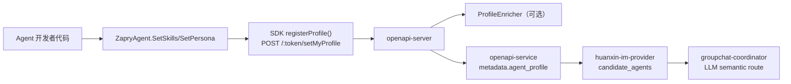

# Zapry Agents SDK for Go

Go SDK for building Agents on Telegram and Zapry platforms — both a low-level API wrapper and a high-level framework with handler routing, lifecycle hooks, environment config, and Zapry compatibility.

---

## Features

- **Two-level API**: Use the low-level `AgentAPI` for full control, or the high-level `ZapryAgent` for rapid development
- **Handler Routing**: Register command, callback, and message handlers with one-line calls
- **Auto Config**: Load all settings from `.env` with automatic Telegram/Zapry platform detection
- **Lifecycle Hooks**: `OnPostInit`, `OnPostShutdown`, `OnError` for clean app lifecycle management
- **Auto Run Mode**: `agent.Run()` automatically selects polling or webhook based on config
- **Zapry Compatibility**: Built-in data normalization for Zapry platform quirks (User/Chat/Message fixes)
- **Middleware Pipeline**: Onion-model middleware with before/after, interception, and shared context
- **Tool Calling Framework**: `ToolRegistry` for LLM-agnostic tool registration, JSON schema export, and execution
- **OpenAI Adapter**: `OpenAIToolAdapter` bridges ToolRegistry with OpenAI function calling API
- **Proactive Scheduler**: `ProactiveScheduler` for timed proactive messaging with custom triggers
- **Feedback Detection**: `FeedbackDetector` auto-detects user feedback signals and adjusts preferences
- **Preference Injection**: `BuildPreferencePrompt()` converts preferences to AI system prompt text
- **Memory Persistence**: Three-layer memory (Working/ShortTerm/LongTerm), pluggable stores, auto-extraction, Zapry Cloud ready
- **Agent Loop**: ReAct automatic reasoning cycle — LLM autonomously calls tools until final answer
- **Guardrails**: Input/Output safety guards with Tripwire mechanism for prompt injection/content filtering
- **Tracing**: Structured span system (agent/llm/tool/guardrail) with pluggable exporters
- **MCP Client**: Connect to any MCP server (Stdio/HTTP) — auto-discover tools and inject into ToolRegistry for transparent use with AgentLoop
- **Zero External Deps**: Pure Go standard library — no third-party dependencies

---

## 当前群聊协作架构（第一阶段）

第一阶段采用“技能 + 人设”最小输入，服务端自动补齐画像字段：



### 推荐用法（代码声明）

```go
agent, _ := agentsdk.NewZapryAgent(config)
agent.SetSkills([]string{"塔罗占卜", "每日运势", "情绪疏导"})
agent.SetPersona("温柔知性的邻家姐姐，擅长倾听与陪伴")
agent.Run()
```

### 配置优先级（当前）

- 首选：代码声明 `SetSkills()` / `SetPersona()`
- 兼容回退：环境变量 `AGENT_SKILLS`（逗号分隔）、`AGENT_PERSONA`
- 服务端自动生成：`description` / `experience` / `tags`（无需 SDK 侧填写）

---

## Quick Start

### Installation

```bash
go get github.com/cyberFlowTech/zapry-agents-sdk-go
```

### High-Level API (Recommended)

```go
package main

import (
    "log"
    agentsdk "github.com/cyberFlowTech/zapry-agents-sdk-go"
)

func main() {
    // Load config from .env automatically
    config, err := agentsdk.NewAgentConfigFromEnv()
    if err != nil {
        log.Fatal(err)
    }

    // Create high-level bot
    bot, err := agentsdk.NewZapryAgent(config)
    if err != nil {
        log.Fatal(err)
    }

    // Register handlers
    agent.AddCommand("start", func(b *agentsdk.AgentAPI, u agentsdk.Update) {
        msg := agentsdk.NewMessage(u.Message.Chat.ID, "Hello! I'm your agent.")
        b.Send(msg)
    })

    agent.AddCommand("help", func(b *agentsdk.AgentAPI, u agentsdk.Update) {
        msg := agentsdk.NewMessage(u.Message.Chat.ID, "Available commands:\n/start - Welcome\n/help - This message")
        b.Send(msg)
    })

    // Handle all private text messages
    agent.AddMessage("private", func(b *agentsdk.AgentAPI, u agentsdk.Update) {
        msg := agentsdk.NewMessage(u.Message.Chat.ID, "You said: "+u.Message.Text)
        b.Send(msg)
    })

    // Lifecycle hooks
    agent.OnPostInit(func(zb *agentsdk.ZapryAgent) {
        log.Println("Agent initialized!")
    })

    agent.OnError(func(b *agentsdk.AgentAPI, u agentsdk.Update, err error) {
        log.Printf("Error: %v", err)
    })

    // Run (auto-detects polling or webhook from config)
    agent.Run()
}
```

### Low-Level API

For full control over the update loop:

```go
package main

import (
    "log"
    agentsdk "github.com/cyberFlowTech/zapry-agents-sdk-go"
)

func main() {
    bot, err := agentsdk.NewAgentAPI("YOUR_BOT_TOKEN")
    if err != nil {
        log.Fatal(err)
    }

    bot.Debug = true

    u := agentsdk.NewUpdate(0)
    u.Timeout = 60
    updates := bot.GetUpdatesChan(u)

    for update := range updates {
        if update.Message == nil {
            continue
        }

        log.Printf("[%s] %s", update.Message.From.UserName, update.Message.Text)

        msg := agentsdk.NewMessage(update.Message.Chat.ID, update.Message.Text)
        msg.ReplyToMessageID = update.Message.MessageID
        bot.Send(msg)
    }
}
```

---

## Architecture

```
┌─────────────────────────────────────────────────────────┐
│                    Your Application                      │
│                                                          │
│  agent.AddCommand("start", handler)                        │
│  agent.AddCallbackQuery("^pattern$", handler)              │
│  agent.AddMessage("private", handler)                      │
│  agent.Run()                                               │
└──────────────────────┬──────────────────────────────────┘
                       │
┌──────────────────────▼──────────────────────────────────┐
│               ZapryAgent (High-Level)                      │
│                                                          │
│  ┌─────────────┐  ┌────────────┐  ┌──────────────────┐  │
│  │  AgentConfig   │  │   Router   │  │ Lifecycle Hooks  │  │
│  │  .env loader │  │  dispatch  │  │ init/shutdown/err│  │
│  └─────────────┘  └────────────┘  └──────────────────┘  │
│                                                          │
│  ┌──────────────────────────────────────────────────┐    │
│  │         ZapryCompat (auto-normalize)              │    │
│  │  Fix User.FirstName, Chat.ID, Chat.Type           │    │
│  └──────────────────────────────────────────────────┘    │
└──────────────────────┬──────────────────────────────────┘
                       │
┌──────────────────────▼──────────────────────────────────┐
│                AgentAPI (Low-Level)                         │
│                                                          │
│  HTTP requests, JSON parsing, file uploads               │
│  GetUpdates / ListenForWebhook / Send / Request          │
└──────────────────────┬──────────────────────────────────┘
                       │
              Telegram / Zapry API
```

---

## API Reference

### Configuration

```go
// Load from environment variables (auto-reads .env file)
config, err := agentsdk.NewAgentConfigFromEnv()

// Properties
config.Platform      // "telegram" or "zapry"
config.BotToken      // Bot token for selected platform
config.RuntimeMode   // "polling" or "webhook"
config.Debug         // Verbose logging
config.IsZapry()     // Convenience check
config.Summary()     // Human-readable config summary
```

### ZapryAgent (High-Level)

```go
// Create bot from config
bot, err := agentsdk.NewZapryAgent(config)

// Handler registration
agent.AddCommand(name string, handler HandlerFunc)
agent.AddCallbackQuery(pattern string, handler HandlerFunc)  // regex pattern
agent.AddMessage(filter string, handler HandlerFunc)          // "private", "group", "all"

// Lifecycle hooks
agent.OnPostInit(func(*ZapryAgent))
agent.OnPostShutdown(func(*ZapryAgent))
agent.OnError(func(*AgentAPI, Update, error))

// Run (blocking, auto-detects mode)
agent.Run()

// Access underlying API
bot.Bot    // *AgentAPI
bot.Config // *AgentConfig
bot.Router // *Router
```

### Handler Function Signature

```go
type HandlerFunc func(bot *AgentAPI, update Update)
```

All handlers receive the low-level `AgentAPI` (for sending messages) and the `Update` (incoming data).

### Router (Standalone)

Can be used independently of `ZapryAgent`:

```go
router := agentsdk.NewRouter()
router.AddCommand("start", handler)
router.AddCallbackQuery("^action_", handler)
router.AddMessage("all", handler)

// Manual dispatch
handled := router.Dispatch(bot, update)
```

### AgentAPI (Low-Level)

```go
// Create
bot, err := agentsdk.NewAgentAPI(token)
bot, err := agentsdk.NewAgentAPIWithAPIEndpoint(token, endpoint)

// Send messages
bot.Send(agentsdk.NewMessage(chatID, "text"))
bot.Send(agentsdk.NewPhoto(chatID, agentsdk.FileURL("https://...")))

// Inline keyboards
keyboard := agentsdk.NewInlineKeyboardMarkup(
    agentsdk.NewInlineKeyboardRow(
        agentsdk.NewInlineKeyboardButtonData("Click me", "callback_data"),
    ),
)
msg.ReplyMarkup = keyboard

// Answer callback queries
bot.Request(agentsdk.NewCallback(callbackID, "Done!"))

// Edit messages
bot.Send(agentsdk.NewEditMessageText(chatID, messageID, "new text"))
```

### Logging

```go
agentsdk.SetupLogging(debug bool, logFile string)
```

### Zapry Compatibility

Automatically applied when `config.Platform == "zapry"`. Can also be called manually:

```go
agentsdk.NormalizeUpdate(&update)
```

**Issues handled:**
- `User.FirstName` empty → fallback to `UserName`
- `Chat.ID` with `g_` prefix → stripped for groups
- `Chat.ID` as bot username string → replaced with `From.ID`
- `Chat.Type` empty → inferred from ID format

---

## Environment Variables

Create a `.env` file in your project root:

```env
# Platform: "telegram" or "zapry"
TG_PLATFORM=telegram

# Bot tokens (set the one matching your platform)
TELEGRAM_BOT_TOKEN=your-telegram-token
# ZAPRY_BOT_TOKEN=your-zapry-token
# ZAPRY_API_BASE_URL=https://openapi.mimo.immo/bot

# Runtime mode: "polling" (dev) or "webhook" (prod)
RUNTIME_MODE=polling

# Webhook config (only for webhook mode)
# TELEGRAM_WEBHOOK_URL=https://your-domain.com
# ZAPRY_WEBHOOK_URL=https://your-domain.com
# WEBAPP_HOST=0.0.0.0
# WEBAPP_PORT=8443

# Debug mode
DEBUG=true

# Optional profile fallback (prefer SetSkills/SetPersona in code)
# AGENT_SKILLS=塔罗占卜,每日运势,情绪疏导
# AGENT_PERSONA=温柔知性的邻家姐姐
```

| Variable | Default | Description |
|----------|---------|-------------|
| `TG_PLATFORM` | `telegram` | Platform: `telegram` or `zapry` |
| `TELEGRAM_BOT_TOKEN` | — | Token for Telegram platform |
| `ZAPRY_BOT_TOKEN` | — | Token for Zapry platform |
| `ZAPRY_API_BASE_URL` | `https://openapi.mimo.immo/bot` | Zapry API endpoint |
| `RUNTIME_MODE` | `polling` | `polling` or `webhook` |
| `WEBAPP_HOST` | `0.0.0.0` | Webhook listen host |
| `WEBAPP_PORT` | `8443` | Webhook listen port |
| `DEBUG` | `false` | Enable verbose logging |
| `LOG_FILE` | — | Optional log file path |
| `AGENT_SKILLS` | — | 候选技能（逗号分隔，代码未设置时回退使用） |
| `AGENT_PERSONA` | — | 候选人设（代码未设置时回退使用） |

---

## Examples

The `examples/` directory contains ready-to-run demos:

| Example | Description |
|---------|-------------|
| `send_text/` | Send a text message |
| `send_image/` | Send an image |
| `send_video/` | Send a video |
| `keyboard/` | Inline keyboard with callbacks |
| `webhook_commmand/` | Webhook mode with command handling |
| `command_set_get/` | Register and retrieve bot commands |
| `command_del/` | Delete bot commands |
| `webhook_set_del/` | Set and delete webhooks |

Run any example:

```bash
cd examples/webhook_commmand
go run main.go
```

---

## Deployment

### Development (Polling)

```env
TG_PLATFORM=telegram
TELEGRAM_BOT_TOKEN=your-token
RUNTIME_MODE=polling
DEBUG=true
```

```bash
go run main.go
```

### Production (Webhook)

```env
TG_PLATFORM=telegram
TELEGRAM_BOT_TOKEN=your-token
RUNTIME_MODE=webhook
TELEGRAM_WEBHOOK_URL=https://your-domain.com
WEBAPP_PORT=8443
DEBUG=false
```

Set up a reverse proxy (Nginx/Caddy) to forward HTTPS to the agent's port.

### Zapry Platform

```env
TG_PLATFORM=zapry
ZAPRY_BOT_TOKEN=your-zapry-token
ZAPRY_API_BASE_URL=https://openapi.mimo.immo/bot
RUNTIME_MODE=webhook
ZAPRY_WEBHOOK_URL=https://your-domain.com
```

---

## Middleware Pipeline

Onion-model middleware wrapping the handler dispatch. Each middleware can execute logic before and after.

```go
agent.Use(func(ctx *agentsdk.MiddlewareContext, next agentsdk.NextFunc) {
    log.Println("before handler")
    ctx.Extra["start"] = time.Now()
    next() // proceed to next middleware / handler
    elapsed := time.Since(ctx.Extra["start"].(time.Time))
    log.Printf("handler took %s", elapsed)
})

// Intercept (don't call next)
agent.Use(func(ctx *agentsdk.MiddlewareContext, next agentsdk.NextFunc) {
    if !isAuthorized(ctx.Update) {
        return // intercepted
    }
    next()
})
```

Execution order: `mw1 before -> mw2 before -> handler -> mw2 after -> mw1 after`

---

## Tool Calling Framework

LLM-agnostic tool registration, JSON schema export, and execution dispatch.

```go
registry := agentsdk.NewToolRegistry()

registry.Register(&agentsdk.Tool{
    Name:        "get_weather",
    Description: "Get weather for a city",
    Parameters: []agentsdk.ToolParam{
        {Name: "city", Type: "string", Description: "City name", Required: true},
        {Name: "unit", Type: "string", Description: "Temperature unit", Default: "celsius"},
    },
    Handler: func(ctx *agentsdk.ToolContext, args map[string]interface{}) (interface{}, error) {
        return fmt.Sprintf("%s: 25C", args["city"]), nil
    },
})

// Export schema
jsonSchema := registry.ToJSONSchema()
openaiTools := registry.ToOpenAISchema()

// Execute
result, err := registry.Execute("get_weather", map[string]interface{}{"city": "Shanghai"}, nil)
```

### OpenAI Function Calling Adapter

```go
adapter := agentsdk.NewOpenAIToolAdapter(registry)
toolsParam := adapter.ToOpenAITools() // for OpenAI API request

// Process tool_calls from OpenAI response
calls := []agentsdk.ToolCallInput{{ID: "c1", Function: struct{...}{Name: "get_weather", Arguments: `{"city":"Shanghai"}`}}}
results := adapter.HandleToolCalls(calls)
messages := adapter.ResultsToMessages(results) // [{role: tool, ...}]
```

---

## Memory Persistence Framework

Three-layer memory model with `{agent_id}:{user_id}` namespace isolation.

```go
store := agentsdk.NewInMemoryMemoryStore()
session := agentsdk.NewMemorySession("my_agent", "user_123", store)

// Load all memory layers
ctx, _ := session.Load()
// ctx.ShortTerm  → conversation history
// ctx.LongTerm   → user profile
// ctx.Working    → session temp data

// Add messages (auto-persisted + buffered)
session.AddMessage("user", "I'm 25, working in Shanghai")
session.AddMessage("assistant", "Got it!")

// Format for LLM prompt injection
prompt := session.FormatForPrompt("")

// Auto-extract memory (requires extractor)
// Option A: legacy flat JSON extraction
session.SetExtractor(agentsdk.NewLLMMemoryExtractor(myLLMFn, ""))
session.ExtractIfNeeded()

// Option B: operation-level consolidation (ADD/UPDATE/DELETE/NOOP)
session.SetExtractor(agentsdk.NewConsolidatingExtractor(myLLMFn, nil))
session.ExtractIfNeeded()

// Option C: async extraction (non-blocking hot path)
async := agentsdk.NewAsyncMemoryExtractor(
    agentsdk.NewConsolidatingExtractor(myLLMFn, nil),
)
defer async.Stop()
session.ExtractAsync(async)

// Typed memory (semantic / episodic / procedural)
typed := agentsdk.NewTypedMemoryStore(store, session.Namespace)
typed.Add(agentsdk.TypedMemory{
    ID:      "pref-1",
    Type:    agentsdk.MemoryTypeProcedural,
    Content: "用户偏好简洁回答",
    Score:   0.9,
})

// Query-aware retrieval with token budget
retriever := agentsdk.NewMemoryRetriever(agentsdk.MemoryRetrieverOptions{
    Structured: session.LongTerm,
    Typed:      typed,
    Budget:     agentsdk.DefaultTokenBudgetConfig(),
})
ctxMem, _ := retriever.Retrieve(context.Background(), "给我用户画像摘要", 8)
_ = ctxMem.Text

// Manual update
session.UpdateLongTerm(map[string]interface{}{
    "basic_info": map[string]interface{}{"age": 25.0},
})

// Clear
session.ClearHistory()  // short-term only
session.ClearAll()      // everything
```

### Storage Backends

| Backend | Layer | Use Case | Persistent |
|---------|------|----------|-----------|
| `InMemoryMemoryStore` | Structured KV/List | Development/testing | No |
| `store.RedisMemoryStore` | Structured KV/List | Hot-path memory (cache, short-term) | Yes |
| `store.MySQLMemoryStore` | Structured KV/List | Durable long-term memory | Yes |
| `store.PgvectorStore` | Vector | Semantic recall via pgvector | Yes |
| `store.QdrantStore` | Vector | Semantic recall via Qdrant | Yes |

### Memory Lifecycle

The SDK now includes lifecycle management primitives:

- `DefaultImportanceScorer` — recency + frequency + type-weight scoring
- `DecayPolicy` — half-life based score decay and prune threshold
- `MemoryLifecycleManager` — scheduled decay/prune + GDPR `ForgetUser()`
- `MemoryAuditLogger` — pluggable audit events for Kafka/ClickHouse pipelines

---

## Agent Loop (Automatic Reasoning Cycle)

ReAct pattern: LLM autonomously decides to call tools, gets results, and reasons again until final answer.

```go
loop := agentsdk.NewAgentLoop(myLLMFn, registry, "You are a helpful assistant.", 10, nil)

result := loop.Run("What's the weather in Shanghai?", nil, "")
fmt.Println(result.FinalOutput)      // "Shanghai is 25°C, sunny."
fmt.Println(result.ToolCallsCount)   // 1
fmt.Println(result.TotalTurns)       // 2
fmt.Println(result.StoppedReason)    // "completed"
```

### Event Hooks

```go
hooks := &agentsdk.AgentLoopHooks{
    OnLLMStart:  func(turn int, msgs []map[string]interface{}) { log.Printf("Turn %d", turn) },
    OnToolStart: func(name string, args map[string]interface{}) { log.Printf("Tool: %s", name) },
    OnError:     func(err error) { log.Printf("Error: %v", err) },
}
loop := agentsdk.NewAgentLoop(llmFn, registry, "sys", 10, hooks)
```

---

## Proactive Scheduler & Feedback Detection

### ProactiveScheduler — Timed Proactive Messaging

Let your bot proactively reach out to users with scheduled messages.

```go
// Create scheduler (60s poll interval)
scheduler := agentsdk.NewProactiveScheduler(60*time.Second, sendFn, nil)

// Register a trigger
scheduler.AddTrigger("daily_greeting",
    // CheckFn: return user IDs to notify
    func(ctx *agentsdk.TriggerContext) []string {
        if ctx.Now.Hour() == 12 {
            return []string{"user_001", "user_002"}
        }
        return nil
    },
    // MessageFn: generate message for each user
    func(ctx *agentsdk.TriggerContext, userID string) string {
        return "Good afternoon! How are you doing today?"
    },
)

scheduler.Start()           // non-blocking background goroutine
defer scheduler.Stop()

scheduler.EnableUser("user_001")   // per-user toggle
scheduler.DisableUser("user_001")
```

### FeedbackDetector — Auto-Adapt to User Feedback

Detect feedback signals from messages and adjust preferences automatically.

```go
detector := agentsdk.NewFeedbackDetector(nil, 50, nil) // default Chinese patterns

// Detect feedback
result := detector.Detect("太长了，说重点", nil)
// result.Matched => true
// result.Changes => {"style": "concise"}

// One-step detect + update
prefs := map[string]string{"style": "balanced"}
detector.DetectAndAdapt("user_001", "太长了", prefs)
// prefs => {"style": "concise", "updated_at": "..."}

// Custom patterns
detector.AddPattern("language", "english", []string{"speak english", "in english"})
```

### BuildPreferencePrompt — AI Prompt Injection

```go
prompt := agentsdk.BuildPreferencePrompt(
    map[string]string{"style": "concise", "tone": "casual"},
    nil, "",  // use defaults
)
// => "回复风格偏好：\n这位用户偏好简洁的回复..."
```

### Integration with ZapryAgent

```go
agent.OnPostInit(func(zb *agentsdk.ZapryAgent) {
    scheduler.Start()
})

agent.OnPostShutdown(func(zb *agentsdk.ZapryAgent) {
    scheduler.Stop()
})

agent.AddMessage("private", func(bot *agentsdk.AgentAPI, u agentsdk.Update) {
    // After replying, detect feedback
    detector.DetectAndAdapt(userID, u.Message.Text, userPrefs)
})
```

---

## MCP Client — Connect Any MCP Server

The SDK includes a built-in MCP (Model Context Protocol) client that lets your Agent connect to any MCP server, automatically discover tools, and use them through the standard `ToolRegistry` — fully transparent to `AgentLoop`.

**Supported transports:**
- **HTTP** — Remote/cloud MCP servers via HTTP POST
- **Stdio** — Local MCP servers via stdin/stdout (e.g. `npx @modelcontextprotocol/server-filesystem`)

### Quick Start

```go
ctx := context.Background()

// 1. Create MCPManager
mcp := agentsdk.NewMCPManager()

// 2. Connect MCP servers
mcp.AddServer(ctx, agentsdk.MCPServerConfig{
    Name:      "filesystem",
    Transport: "stdio",
    Command:   "npx",
    Args:      []string{"-y", "@modelcontextprotocol/server-filesystem", "/tmp"},
})

mcp.AddServer(ctx, agentsdk.MCPServerConfig{
    Name:    "search",
    Transport: "http",
    URL:     "https://mcp.example.com/search",
    Headers: map[string]string{"Authorization": "Bearer xxx"},
})

// 3. Inject into ToolRegistry (alongside local tools)
registry := agentsdk.NewToolRegistry()
registry.Register(myLocalTool)   // your own tools
mcp.InjectTools(registry)         // MCP tools auto-added

// 4. AgentLoop uses MCP tools transparently
loop := agentsdk.NewAgentLoop(myLLM, registry, "You are helpful.", 10, nil)
result := loop.Run("Read /tmp/data.txt", nil, "")
// LLM automatically selects mcp.filesystem.read_file

// 5. Cleanup
defer mcp.DisconnectAll()
```

### MCPServerConfig

| Field | Type | Description |
|-------|------|-------------|
| `Name` | `string` | Unique server identifier |
| `Transport` | `string` | `"http"` or `"stdio"` |
| `URL` | `string` | HTTP endpoint (for `http` transport) |
| `Headers` | `map[string]string` | Custom HTTP headers (e.g. auth) |
| `Command` | `string` | Executable path (for `stdio` transport) |
| `Args` | `[]string` | Command arguments |
| `Env` | `map[string]string` | Extra environment variables |
| `Timeout` | `int` | Timeout in seconds (default: 30) |
| `MaxRetries` | `int` | Retries for 5xx/network errors (default: 3) |
| `AllowedTools` | `[]string` | Whitelist filter (wildcards: `read_*`) |
| `BlockedTools` | `[]string` | Blacklist filter (wildcards: `write_*`) |
| `MaxTools` | `int` | Max tools to inject (0 = no limit) |

### Tool Filtering

Filters match **original MCP tool names** (not the injected SDK names). Supports wildcards via `path.Match`:

```go
mcp.AddServer(ctx, agentsdk.MCPServerConfig{
    Name:         "filesystem",
    Transport:    "stdio",
    Command:      "npx",
    Args:         []string{"-y", "@modelcontextprotocol/server-filesystem", "/tmp"},
    AllowedTools: []string{"read_*", "list_*"},   // only read/list tools
    BlockedTools: []string{"write_*", "delete_*"}, // block dangerous tools
    MaxTools:     10,                               // limit context size
})
```

### Tool Naming

MCP tools are injected with the prefix `mcp.{server}.{tool}`:
- `read_file` on server `filesystem` → `mcp.filesystem.read_file`
- `query` on server `database` → `mcp.database.query`

This prevents name conflicts with local tools and between multiple MCP servers.

### Injection Behavior

- **Idempotent**: Calling `InjectTools()` multiple times is safe (removes old tools first)
- **Precise removal**: `RemoveTools()` only removes MCP-injected tools, never your local tools
- **Caller-controlled**: Injection is done by you, not inside `AgentLoop.Run()` — no concurrency issues

### StdioTransport Notes

- MCP server must output **one JSON-RPC message per line** on stdout
- stderr is consumed and logged, never parsed as JSON
- Process exit is detected and returns clear errors
- No 64K line limit (uses `bufio.Reader`, not `bufio.Scanner`)
- Cancel/timeout properly propagated via `context.Context`

### Schema Fidelity

MCP tool `inputSchema` is preserved as-is in `Tool.RawJSONSchema`. When sending to the LLM, the original JSON Schema (including nested objects, `oneOf`, `enum`, etc.) is used directly — not a lossy conversion to `ToolParam`.

---

## Project Structure

```
zapry-agents-sdk-go/
│
│  ── AI Agent Framework (package agentsdk) ──
│
├── agent_loop.go           # AgentLoop — ReAct reasoning cycle + RunContext cancel
├── tools.go                # ToolRegistry, ToolDef, ToolParam, @tool schema
├── tools_openai.go         # OpenAIToolAdapter — function calling bridge
│
├── memory_store.go         # MemoryStore interface + InMemoryStore
├── memory_types.go         # MemoryMessage, MemoryContext
├── memory_layers.go        # WorkingMemory + ShortTermMemory + LongTermMemory
├── memory_buffer.go        # ConversationBuffer — extraction trigger
├── memory_extractor.go     # MemoryExtractor + LLMMemoryExtractor
├── memory_consolidator.go  # Operation-level memory consolidation (ADD/UPDATE/DELETE/NOOP)
├── memory_async.go         # Async extraction pipeline (background workers)
├── memory_embedding.go     # EmbeddingStore interface + SemanticMemoryStore
├── memory_typed.go         # Typed memory (semantic/episodic/procedural)
├── memory_retriever.go     # Query-aware retrieval + token budget truncation
├── memory_lifecycle.go     # Importance scoring + decay + lifecycle + audit
├── memory_formatter.go     # FormatMemoryForPrompt — prompt injection
├── memory_session.go       # MemorySession — high-level convenience API
│
├── mcp_config.go           # MCP Client — MCPServerConfig, tool filtering
├── mcp_transport.go        # MCP Client — HTTPTransport, StdioTransport
├── mcp_protocol.go         # MCP Client — JSON-RPC 2.0, MCPClient, MCPError
├── mcp_converter.go        # MCP Client — MCP tool → SDK Tool conversion
├── mcp_manager.go          # MCP Client — MCPManager, injection, routing
│
├── conversation_state.go   # Natural — ConversationStateTracker
├── emotional_tone.go       # Natural — EmotionalToneDetector (bilingual)
├── response_style.go       # Natural — ResponseStyleController (PostProcess)
├── conversation_opener.go  # Natural — OpenerGenerator
├── context_compressor.go   # Natural — ContextCompressor (token-gated)
├── prompt_fragments.go     # Natural — PromptFragments (KV + Warnings)
├── natural_conversation.go # Natural — NaturalConversation + WrapLoop
│
├── guardrails.go           # Guardrails — Input/Output safety guards + Tripwire
├── tracing.go              # Tracing — Structured span system with exporters
├── proactive.go            # ProactiveScheduler — timed proactive messaging
├── feedback.go             # FeedbackDetector — feedback detection & preference
│
├── agent_card.go           # Multi-Agent — AgentCard
├── agent_engine.go         # Multi-Agent — HandoffEngine
├── agent_handoff.go        # Multi-Agent — Handoff types
├── agent_policy.go         # Multi-Agent — HandoffPolicy
├── agent_registry.go       # Multi-Agent — AgentRegistry
│
│  ── Channel Layer (IM platform implementations) ──
│
├── channel/
│   ├── telegram/            # Telegram Bot API (package telegram)
│   │   ├── api.go          # AgentAPI — HTTP client, Send/Request/GetUpdates
│   │   ├── types.go        # Telegram Bot API type definitions
│   │   ├── configs.go      # Request config types (MessageConfig, PhotoConfig, etc.)
│   │   ├── helpers.go      # Convenience constructors (NewMessage, NewPhoto, etc.)
│   │   ├── params.go       # URL parameter handling
│   │   ├── compat.go       # Zapry compatibility layer (auto-enabled when platform="zapry")
│   │   ├── agent.go        # ZapryAgent — high-level framework, polling/webhook
│   │   ├── config.go       # AgentConfig — .env loading, platform detection
│   │   ├── router.go       # Router — command/callback/message dispatch
│   │   ├── middleware.go    # Middleware — onion-model pipeline
│   │   ├── log.go          # Logger interface
│   │   └── passport.go     # Telegram Passport types
│   │
│   └── zapry/               # Zapry platform channel (package zapry)
│       ├── agent.go         # Zapry Agent — wraps Telegram with auto compat
│       └── compat.go        # Zapry compatibility notes & known data issues reference
│
├── examples/               # Ready-to-run example bots
└── *_test.go               # Tests
```

### Optional Store Module

Production backends are provided in a separate submodule to keep core `agentsdk`
dependency-light:

```
store/
├── redis.go                # RedisMemoryStore (KV/List backend)
├── mysql.go                # MySQLMemoryStore (KV/List backend)
├── pgvector.go             # PgvectorStore (vector backend)
└── qdrant.go               # QdrantStore (vector backend)
```

---

## Related Projects

- [zapry-bot-sdk-python](https://github.com/cyberFlowTech/zapry-bot-sdk-python) — Python SDK (equivalent high-level framework)
- [zapry-bot-agents-demo-python](https://github.com/cyberFlowTech/zapry-bot-agents-demo-python) — Full-featured AI Agent demo (Python)

---

## License

MIT — see [LICENSE.txt](LICENSE.txt)
