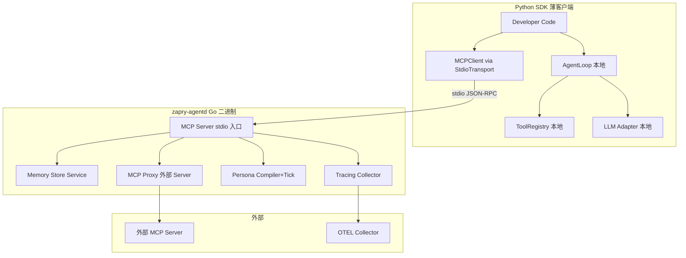

# Go-First SDK + agentd Sidecar 方案

## 核心策略

- **Go SDK 是唯一的全功能 SDK**，所有新子系统只在 Go 中实现
- **Go SDK 编译出 `zapry-agentd` 二进制**（MCP Server，stdio 模式）
- **Python SDK 冻结**，不再加新功能；新能力通过 agentd 获取
- **Python/Node 保留本地的 AgentLoop + ToolRegistry + LLM 调用**（用户代码是原生的）
- 其他能力（Memory、Tracing、Persona、MCP 代理）全部通过 agentd 远程调用

## 什么适合远程化，什么不适合

```
留在本地（每个语言必须有，但已经写好了不用再改）：
├── AgentLoop（ReAct 循环 — 调用用户的 LLM 函数）
├── ToolRegistry（注册/执行用户的原生工具函数）
└── LLM Adapter（用户写的，语言绑定的）

通过 agentd 远程化（新功能只写一次 Go）：
├── Memory Store（KV + List 接口，完美适合远程化）
├── Tracing（span 批量上报，异步，不影响延迟）
├── Persona Compile/Get/Tick（已有 ai-persona-engine）
├── MCP Proxy（agentd 代理连接外部 MCP Server）
└── 未来所有新子系统
```

**注意**：Guardrails 当前是用户传入 Go 函数（`GuardrailFunc`），无法远程化。如果后续要做平台级 Guardrails（规则从云端下发），那时再加 `guardrails.check` 工具。

## 架构图




---

## agentd 暴露的 MCP 工具（Stage 1：10 个工具）

### Memory Store（6 个工具 — 对应 MemoryStore 接口）


| 工具名                 | 对应 Go 接口                                      | 说明    |
| ------------------- | --------------------------------------------- | ----- |
| `memory.get`        | `MemoryStore.Get(ns, key)`                    | 读取 KV |
| `memory.set`        | `MemoryStore.Set(ns, key, value)`             | 写入 KV |
| `memory.delete`     | `MemoryStore.Delete(ns, key)`                 | 删除 KV |
| `memory.append`     | `MemoryStore.Append(ns, key, value)`          | 追加到列表 |
| `memory.get_list`   | `MemoryStore.GetList(ns, key, limit, offset)` | 读取列表  |
| `memory.clear_list` | `MemoryStore.ClearList(ns, key)`              | 清空列表  |


Python SDK 实现一个 `RemoteMemoryStore`（实现 MemoryStore 协议），内部把每个方法转为 MCP 工具调用。这样 Python 的 `MemorySession` 可以直接用这个 store，无需重新实现 Memory 逻辑。

### Tracing（1 个工具）


| 工具名          | 说明                 |
| ------------ | ------------------ |
| `trace.emit` | 批量上报 spans（异步，不阻塞） |


### Persona（3 个工具 — 集成 ai-persona-engine）


| 工具名               | 说明                               |
| ----------------- | -------------------------------- |
| `persona.compile` | PersonaSpec -> RuntimeConfig     |
| `persona.get`     | 按 persona_id 获取 RuntimeConfig    |
| `persona.tick`    | 生成 PersonaTick（时间感知 + 心情 + 风格约束） |


---

## 实现细节

### 1. agentd 二进制（在 zapry-agents-sdk-go 仓库，`cmd/agentd/`）

```
zapry-agents-sdk-go/
├── cmd/
│   └── agentd/
│       └── main.go         # 入口：读 stdin JSON-RPC，路由到 handler
├── agentd_server.go        # MCP Server 核心（initialize/tools/list/tools/call 路由）
├── agentd_memory.go        # memory.* 工具 handler
├── agentd_tracing.go       # trace.emit handler
├── agentd_persona.go       # persona.* handler（import persona-engine）
└── ... 现有 SDK 文件不变
```

`cmd/agentd/main.go` 做的事：

1. `bufio.NewReaderSize(os.Stdin, 1MB)` 按行读 JSON-RPC
2. 解析 method，分发到对应 handler
3. 结果写 `os.Stdout`（一行一个 JSON）
4. stderr 输出日志

**agentd 依赖 persona-engine**：在 `go.mod` 中 `require github.com/aspect-build/zapry-persona-engine`，直接 import compiler/tick/store 包。

### 2. Python SDK 新增 `RemoteMemoryStore`

在冻结的 Python SDK 中，只加这一个文件（因为它让现有 MemorySession 能无缝切换到远程 store）：

```python
# zapry_agents_sdk/memory/store_remote.py

class RemoteMemoryStore:
    """MemoryStore backed by agentd MCP Server."""

    def __init__(self, mcp_client):
        self._client = mcp_client

    async def get(self, namespace, key):
        result = await self._client.call_tool("memory.get", {"namespace": namespace, "key": key})
        return result  # string

    async def set(self, namespace, key, value):
        await self._client.call_tool("memory.set", {"namespace": namespace, "key": key, "value": value})

    # ... append, get_list, clear_list, delete 同理
```

### 3. Python SDK `AgentdClient` 入口

```python
# zapry_agents_sdk/agentd_client.py

class AgentdClient:
    """Auto-start zapry-agentd and provide access to shared subsystems."""

    def __init__(self, agentd_path="zapry-agentd"):
        # 检测 PATH 中的二进制
        # 用 StdioTransport 启动子进程
        # MCPClient initialize + tools/list

    @property
    def memory_store(self) -> RemoteMemoryStore:
        """返回远程 MemoryStore，可直接传给 MemorySession。"""

    async def persona_compile(self, spec: dict) -> dict:
    async def persona_get(self, persona_id: str) -> dict:
    async def persona_tick(self, persona_id: str, user_id: str) -> dict:

    async def trace_emit(self, spans: list) -> None:

    async def close(self):
```

### 4. Python 开发者使用示例

```python
from zapry_agents_sdk import AgentLoop, ToolRegistry, tool
from zapry_agents_sdk.agentd_client import AgentdClient
from zapry_agents_sdk.memory import MemorySession

# 自动启动 agentd（stdio 模式）
agentd = AgentdClient()

# Memory 走远程 store（agentd 管持久化）
session = MemorySession("my_agent", "user_123", store=agentd.memory_store)
await session.load()

# Persona 编译
config = await agentd.persona_compile({
    "name": "林晚晴",
    "traits": ["温柔", "理性"],
    "relationship_style": "friend",
})

# AgentLoop 仍在本地（调用本地 LLM 和本地工具）
loop = AgentLoop(
    llm_fn=my_openai_llm,
    tool_registry=registry,
    system_prompt=config["system_prompt"],
)
result = await loop.run(user_input, extra_context=session.format_for_prompt())

# 清理
await agentd.close()
```

**关键点**：Python 开发者的 AgentLoop + ToolRegistry + LLM 函数 + @tool 工具全部在本地运行。只有 Memory 存储、Persona 编译、Tracing 走 agentd。

---

## Fallback 策略

- `AgentdClient()` 初始化时如果找不到二进制 → 返回后打日志，`memory_store` 返回 `InMemoryStore`（本地内存兜底）
- persona 方法不可用 → 开发者手动传 `system_prompt`
- trace 不可用 → 丢弃
- **AgentLoop 完全不受影响**

---

## 不做的事

- 不做自动下载二进制（用户 `go install ./cmd/agentd` 或下载 release）
- 不做进程复用（每个 AgentdClient 启动自己的子进程）
- 不做 Guardrails 远程化（当前是用户函数，无法远程）
- 不改 Python 已有的 AgentLoop/ToolRegistry/tools/MCP Client

---

## 测试矩阵

### agentd（~12 个）

- initialize 返回正确 server_info
- tools/list 返回 10 个工具 + schemaHash
- memory.get/set/delete/append/get_list/clear_list 端到端
- trace.emit 批量接受
- persona.compile/get/tick 端到端
- 无效工具名 → JSON-RPC error

### Python RemoteMemoryStore + AgentdClient（~6 个）

用 InProcessTransport mock agentd：

- RemoteMemoryStore 所有方法通过 MCP 调用
- AgentdClient 初始化 + persona 调用
- 二进制不可用 → fallback to InMemoryStore

---

## 实施顺序

1. `agentd_server.go` — MCP stdio 入口 + initialize/tools_list/tools_call 路由
2. `agentd_memory.go` — memory.* 6 个工具 handler
3. `agentd_tracing.go` — trace.emit handler
4. `agentd_persona.go` — persona.* 3 个 handler（import persona-engine）
5. `cmd/agentd/main.go` — 二进制入口
6. agentd 测试（~12 个）
7. Python `store_remote.py` + `agentd_client.py`
8. Python 测试（~6 个）
9. 提交 + 推送

