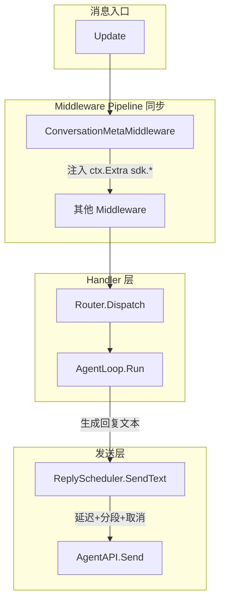

# 拟人化回复 SDK 升级 — 修订执行方案

基于原方案 + 4 个架构问题修正 + 6 条改进建议。

## 架构修正总结

1. **ReplyScheduler 不是 Middleware，是发送层的独立包装** -- 提供 `SendText()` 方法，不改 `AgentAPI.Send`
2. **ConversationID 默认 = ChatID（string）**，允许业务 override
3. **ConversationMetaStore 提供 InMemory 默认实现** -- 开箱即用，无外部依赖
4. **Middleware 保持同步签名不变** -- MetaMiddleware 内部只读 TTL cache（同步），miss 时同步查 store（可容忍）
5. **Cancel 用自增 jobID 替代指针比较**
6. **Jitter 后再 clamp 一次 MinDelay**
7. **InterChunkDelay 也加 jitter**
8. **splitNatural 硬切找最近标点/空格**
9. **turn_index 存在 WorkingMemory 里**（复用现有 Memory 系统）

## 架构图




**关键**：ReplyScheduler 在 Handler **之后**工作（发送时），不在 Middleware Pipeline 里。MetaMiddleware 在 Handler **之前**工作（注入元数据）。

---

## 新增文件清单（4 个源码 + 1 个测试）

- `reply_scheduler.go` -- ReplyScheduler + ReplyOptions + DelayMeta + splitNatural
- `conversation_meta.go` -- ConversationMetaMiddleware + ConversationMeta + ConversationMetaStore + InMemoryConversationMetaStore + TTL cache
- `humanlike_config.go` -- HumanLikeConfig 灰度开关（struct 而非环境变量）
- `reply_scheduler_test.go` -- ReplyScheduler 全量测试
- `conversation_meta_test.go` -- ConversationMeta 全量测试

**不修改任何现有文件**（零侵入）。

---

## S1: reply_scheduler.go

### ReplyOptions

```go
type ReplyOptions struct {
    Enabled         bool
    MinDelay        time.Duration // default 800ms
    MaxDelay        time.Duration // default 2500ms
    MaxTotalDelay   time.Duration // default 4s
    TypingSpeed     int           // chars/sec (rune count), 0=disabled, default 15
    ChunkThreshold  int           // split if > N runes, 0=disabled, default 240
    InterChunkDelay time.Duration // default 350ms
    JitterPct       float64       // 0~1, default 0.2
    CancelOnNewMsg  bool          // default true
    DelayFunc       func(msgLen int, meta DelayMeta) time.Duration // custom, highest priority
}

func DefaultReplyOptions() ReplyOptions // 返回上面推荐默认值
```

### DelayMeta

```go
type DelayMeta struct {
    ConversationID string
    TurnIndex      int
    IsFollowUp     bool
    LastUserMsgAt  time.Time
}
```

### ReplyScheduler

```go
type ReplyScheduler struct {
    opt      atomic.Value      // stores ReplyOptions
    mu       sync.Mutex
    jobs     map[string]*replyJob // key: conversationID
    nextJobID atomic.Uint64
    rng      *rand.Rand
    rngMu    sync.Mutex
}

type replyJob struct {
    id     uint64
    cancel context.CancelFunc
}

func NewReplyScheduler() *ReplyScheduler
func (s *ReplyScheduler) SetOptions(opt ReplyOptions)
func (s *ReplyScheduler) Options() ReplyOptions
func (s *ReplyScheduler) Cancel(conversationID string)
```

### 核心方法：SendText

```go
func (s *ReplyScheduler) SendText(
    ctx context.Context,
    bot *AgentAPI,
    chatID string,
    text string,
    conversationID string,
    meta DelayMeta,
) error
```

**不改 `AgentAPI.Send**`。业务层在 handler 中调用 `scheduler.SendText(...)` 替代直接 `bot.Send(NewMessage(...))`。

内部流程：

1. 如果 `!opt.Enabled` → 直接 `bot.Send(NewMessage(chatID, text))`
2. 如果 `CancelOnNewMsg` → `s.Cancel(conversationID)`
3. 创建 jobCtx + cancel，存入 jobs（用 jobID 精确匹配清理）
4. 计算 delay（computeDelay）
5. `sleepOrCancel(jobCtx, delay)`
6. 分段（splitNatural）
7. 逐段发送，每段前 `sleepOrCancel(jobCtx, interChunkDelay * jitter)`，每段前检查取消

### computeDelay

```go
func (s *ReplyScheduler) computeDelay(opt ReplyOptions, msgLen int, meta DelayMeta) time.Duration
```

- 如果 `DelayFunc != nil` → 直接使用，但结果 clamp 到 `[MinDelay, min(MaxDelay, MaxTotalDelay)]`
- 否则：`base = MinDelay + msgLen/TypingSpeed * Second`
- clamp 到 `[MinDelay, min(MaxDelay, MaxTotalDelay)]`
- 应用 jitter：`d *= (1 + rand[-1,1] * JitterPct)`
- **jitter 后再 clamp 一次 `max(d, MinDelay)**`（修正原方案负值/过小风险）

### splitNatural

```go
func splitNatural(text string, maxParts int) []string
```

策略：

1. 先按 `\n\n` 分段，如果段数 <= maxParts → 返回
2. 否则按中文/英文句号、问号、感叹号切分
3. 兜底硬切时：**找最近的空格或标点边界**，不在词/字中间断（修正原方案）
4. 过滤空段

---

## S2: conversation_meta.go

### ConversationMeta（注入到 ctx.Extra 的结构）

```go
type ConversationMeta struct {
    ConversationID    string
    ConversationCount int
    LastConversationAt time.Time
    DaysSinceLast     int
    SessionTurnIndex  int
    IsFollowUp        bool
    MsgLenBucket      string // "short" / "medium" / "long"
}
```

### ConversationMetaStore 接口 + 默认实现

```go
type ConversationMetaStore interface {
    GetMeta(conversationID string) (count int, lastAt time.Time, err error)
    Touch(conversationID string, now time.Time) error
}
```

**InMemoryConversationMetaStore**：

- `sync.RWMutex` + `map[string]*metaEntry`
- `metaEntry{count int, lastAt time.Time}`
- `Touch` 时 count++ 并更新 lastAt

### ConversationMetaOptions

```go
type ConversationMetaOptions struct {
    Enabled        bool
    CacheTTL       time.Duration // default 45s
    FollowUpWithin time.Duration // default 60s
    Timezone       string        // default "UTC"
}
```

### Middleware 工厂函数

```go
func ConversationMetaMiddleware(store ConversationMetaStore, opt ConversationMetaOptions) MiddlewareFunc
```

返回 `func(ctx *MiddlewareContext, next NextFunc)` — **符合现有同步签名**。

内部实现：

1. 如果 `!opt.Enabled` → 直接 `next()`
2. 从 Update 中提取 conversationID（默认 = `Chat.ID` string）
3. TTL cache 查询（内部 `sync.Map` + 过期检查），miss 时同步调 `store.GetMeta`
4. 计算 `daysSinceLast`
5. `turn_index`：从 `ctx.Extra["sdk.session.turn_index"]` 读 + 自增（如果有 WorkingMemory 则用它）
6. `is_followup`：从 `ctx.Extra["sdk.user.last_msg_at"]` 判断
7. `msg_len_bucket`：< 20 short / 20-120 medium / > 120 long
8. 注入全部到 `ctx.Extra` 带 `sdk.` 命名空间前缀
9. 调用 `next()`

### 注入的 Key 列表（命名空间隔离）

- `sdk.conversation.id`
- `sdk.conversation.count`
- `sdk.conversation.last_at` (RFC3339)
- `sdk.conversation.days_since_last`
- `sdk.session.turn_index`
- `sdk.user.is_followup`
- `sdk.user.msg_len_bucket`
- `sdk.runtime.now` (RFC3339)
- `sdk.runtime.timezone`

### TTL Cache（内部实现，不导出）

```go
type ttlCache struct {
    mu      sync.RWMutex
    entries map[string]*cacheEntry
    ttl     time.Duration
}
```

---

## S3: humanlike_config.go

```go
type HumanLikeConfig struct {
    ReplyScheduler      bool // 总开关 S1
    ConversationMeta    bool // 总开关 S2
}
```

轻量配置 struct，不用环境变量。业务在初始化时传入。

---

## 使用示例（业务侧）

```go
agent, _ := agentsdk.NewZapryAgent(config)

// S2: 注册 ConversationMeta 中间件
metaStore := agentsdk.NewInMemoryConversationMetaStore()
agent.Use(agentsdk.ConversationMetaMiddleware(metaStore, agentsdk.ConversationMetaOptions{
    Enabled:        true,
    FollowUpWithin: 60 * time.Second,
}))

// S1: 创建 ReplyScheduler
scheduler := agentsdk.NewReplyScheduler()
scheduler.SetOptions(agentsdk.DefaultReplyOptions())

// 在 handler 中使用
agent.AddMessage("all", func(bot *agentsdk.AgentAPI, update agentsdk.Update) {
    chatID := update.Message.Chat.ID
    text := "这是 AI 生成的回复..."

    // 通过 scheduler 发送（自动延迟+分段+取消）
    scheduler.SendText(
        context.Background(),
        bot,
        chatID,
        text,
        chatID, // conversationID = chatID
        agentsdk.DelayMeta{ConversationID: chatID},
    )
})
```

---

## 测试矩阵

### reply_scheduler_test.go (~18 用例)

**延迟计算 (6)**:

- `TestComputeDelay_Basic` -- MinDelay + TypingSpeed
- `TestComputeDelay_ClampMax` -- 不超过 MaxDelay
- `TestComputeDelay_MaxTotalDelay` -- MaxTotalDelay 截断
- `TestComputeDelay_TypingSpeedDisabled` -- TypingSpeed=0 只用 MinDelay
- `TestComputeDelay_Jitter_InRange` -- jitter 后仍在 [MinDelay, MaxDelay] 范围
- `TestComputeDelay_CustomDelayFunc` -- DelayFunc 优先级最高

**取消 (4)**:

- `TestCancel_NewMessageCancelsOld` -- 同 conversationID 新消息取消旧 job
- `TestCancel_DifferentConversation_NoCancel` -- 不同 conversationID 不互相取消
- `TestCancel_AlreadyCompleted_NoPanic` -- 已完成的 job cancel 无 panic
- `TestCancel_JobIDPrecise` -- jobID 精确匹配，不误删

**分段 (4)**:

- `TestSplitNatural_ByParagraph` -- 按 \n\n 分段
- `TestSplitNatural_BySentence` -- 按句号/问号切分
- `TestSplitNatural_MaxParts` -- 不超过 maxParts
- `TestSplitNatural_FallbackNoEmptyParts` -- 硬切不产生空段，不断词

**集成 (4)**:

- `TestSendText_Disabled_ImmediateSend` -- Enabled=false 直接发送
- `TestSendText_WithDelay` -- 延迟后发送（验证 >=MinDelay）
- `TestSendText_WithChunking` -- 长文本分段发送
- `TestSendText_CancelMidFlight` -- 发送中途被取消

### conversation_meta_test.go (~14 用例)

**Store (3)**:

- `TestInMemoryStore_GetMeta_Empty` -- 初始 count=0
- `TestInMemoryStore_Touch_Increments` -- Touch 后 count+1
- `TestInMemoryStore_Touch_UpdatesLastAt` -- lastAt 更新

**Cache (3)**:

- `TestTTLCache_Hit` -- 命中缓存不查 store
- `TestTTLCache_Miss` -- 缓存过期后重新查
- `TestTTLCache_Expiry` -- TTL 到期后条目清理

**Middleware (8)**:

- `TestMeta_DaysSinceLast_Correct` -- 3 天前 → daysSinceLast=3
- `TestMeta_IsFollowUp_Within60s` -- 60s 内追问 → true
- `TestMeta_IsFollowUp_After60s` -- 超过 60s → false
- `TestMeta_TurnIndex_Increments` -- 每条消息 +1
- `TestMeta_MsgLenBucket` -- short/medium/long 判定
- `TestMeta_Disabled_NoInjection` -- Enabled=false 不注入
- `TestMeta_NamespaceKeys` -- 所有 key 都有 sdk. 前缀
- `TestMeta_ConversationID_FromChatID` -- 默认从 Chat.ID 提取

