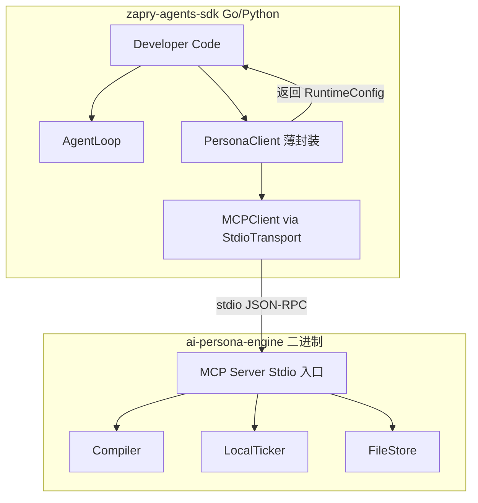

# Zero-Config Persona Sidecar — 基于现有 ai-persona-engine

## 关键发现

`ai-persona-engine` 已经是一个完整的 Persona 系统：

- [pkg/compiler/compiler.go](../ai-persona-engine/pkg/compiler/compiler.go) — PersonaSpec -> RuntimeConfig 编译器（含 MBTI、模板、状态机、事件池）
- [service/server.go](../ai-persona-engine/service/server.go) — HTTP Server（`/v1/persona/compile` + `/v1/persona/{id}`）
- [pkg/tick/ticker.go](../ai-persona-engine/pkg/tick/ticker.go) — LocalTicker（时间感知 + 心情 + 风格约束）
- [sdk/go/persona_agent.go](../ai-persona-engine/sdk/go/persona_agent.go) — Go SDK（Compile + Tick + BuildMessages + Violation）
- [sdk/python/persona_engine/](../ai-persona-engine/sdk/python/persona_engine/) — Python SDK
- [pkg/store/store.go](../ai-persona-engine/pkg/store/store.go) — PersonaStore 接口 + Memory/File 实现

**不需要从零写 agentd**。只需要给现有 persona-engine 加一个 MCP Server 入口（Stdio 模式）。

---

## 架构




**核心思路**：persona-engine 已有全部业务逻辑，只需要加一个 MCP 协议入口（~200 行），SDK 侧通过已有的 StdioTransport + MCPClient 连接它。

---

## 改动范围

### ai-persona-engine 仓库（新增 1 个文件 + 修改 1 个文件）

**新增**：`cmd/agentd/main.go` — MCP Server stdio 入口

这个文件做的事：

1. 从 stdin 读 JSON-RPC 请求
2. 路由到对应 handler：
  - `initialize` → 返回 server info + capabilities
  - `tools/list` → 返回 3 个工具定义
  - `tools/call` → 根据 tool name 分发到 Compiler/Ticker/Store
3. 把结果写回 stdout

暴露的 MCP 工具（3 个）：

- `**persona.compile**` — 输入 PersonaSpec JSON，输出 RuntimeConfig JSON
  - 内部调用 `compiler.Compile()` + `store.Save()`
  - 幂等：相同 spec_hash 返回缓存
- `**persona.get**` — 输入 persona_id + version，输出 RuntimeConfig JSON
  - 内部调用 `store.Get()` / `store.GetVersion()`
- `**persona.tick**` — 输入 persona_id + user_id + recent_event_ids，输出 PersonaTick JSON
  - 内部调用 `store.Get()` 加载 config，然后 `ticker.Tick()`
  - 这让 Tick 也可以远程化（Python/Node 不用重新实现 tick 逻辑）

**修改**：`cmd/server/main.go` — 加一个 `--stdio` flag

```go
if *stdioFlag {
    // 启动 MCP stdio 模式
    runMCPStdio(store)
} else {
    // 原有 HTTP 模式
    service.NewServer(addr, store).Start()
}
```

---

### zapry-agents-sdk-go 仓库（新增 1 个文件）

**新增**：`persona_client.go` — PersonaClient 薄封装

```go
type PersonaClient struct {
    manager *MCPManager
}

func NewPersonaClient() *PersonaClient
    // 内部：用 StdioTransport 启动 persona-engine 二进制
    // 自动检测 PATH 中的 zapry-agentd / persona-engine
    // 找不到 → 返回 nil + 日志提示安装

func (c *PersonaClient) Compile(ctx context.Context, spec map[string]interface{}) (*PersonaConfig, error)
    // 内部调用 MCPManager.CallTool(ctx, "persona.compile", spec)

func (c *PersonaClient) Get(ctx context.Context, personaID string) (*PersonaConfig, error)

func (c *PersonaClient) Tick(ctx context.Context, personaID, userID string, recentEventIDs []string) (*PersonaTick, error)

func (c *PersonaClient) Close() error
```

`PersonaConfig` 和 `PersonaTick` 是 `map[string]interface{}` 的薄类型包装，或者直接 import persona-engine 的 models（如果同一个 Go module 可以引用）。

由于 persona-engine 是独立仓库（`github.com/aspect-build/zapry-persona-engine`），SDK 中用 `map[string]interface{}` 更解耦——不引入依赖。

---

### zapry-agents-sdk-python 仓库（新增 1 个文件）

**新增**：`zapry_agents_sdk/persona_client.py` — Python PersonaClient

```python
class PersonaClient:
    def __init__(self, agentd_command="zapry-agentd"):
        # 内部用 StdioTransport + MCPClient 连接

    async def compile(self, spec: dict) -> dict:
        # 调用 persona.compile 工具

    async def get(self, persona_id: str, version: str = "latest") -> dict:

    async def tick(self, persona_id: str, user_id: str, recent_event_ids: list = None) -> dict:

    async def close(self):
```

这个文件复用已有的 `zapry_agents_sdk.mcp` 模块（StdioTransport + MCPClient + MCPManager）——**零新依赖**。

---

## 开发者使用示例

### Go

```go
// 自动启动 persona-engine（stdio 模式）
persona := agentsdk.NewPersonaClient()
defer persona.Close()

// 编译 persona
config, _ := persona.Compile(ctx, map[string]interface{}{
    "name": "林晚晴",
    "traits": []string{"温柔", "理性", "有洞察力"},
    "relationship_style": "friend",
    "personality_system": "MBTI",
    "personality_code": "INTJ",
})

// 每轮对话前 tick
tick, _ := persona.Tick(ctx, config["persona_id"].(string), "user_123", nil)

// 用 AgentLoop 正常对话
loop := agentsdk.NewAgentLoop(myLLM, registry, config["system_prompt"].(string), 10, nil)
result := loop.RunContext(ctx, userInput, history, tick["prompt_injection"].(string))
```

### Python

```python
from zapry_agents_sdk.persona_client import PersonaClient

persona = PersonaClient()  # auto-start persona-engine via stdio

config = await persona.compile({
    "name": "林晚晴",
    "traits": ["温柔", "理性"],
    "relationship_style": "friend",
})

tick = await persona.tick(config["persona_id"], "user_123")

loop = AgentLoop(llm_fn=my_llm, tool_registry=registry,
                 system_prompt=config["system_prompt"])
result = await loop.run(user_input, extra_context=tick["prompt_injection"])
```

---

## 不做的事（明确排除）

- **不做自动下载二进制** — 用户需要 `go install` 或从 release 下载 persona-engine
- **不做进程复用** — 每个 PersonaClient 启动自己的子进程，随 Close 退出
- **不做 Guardrails/Tracing sidecar 化** — 留在本地
- **不改现有 HTTP Server** — MCP stdio 模式是新增入口，HTTP 照常可用
- **不改 SDK 的 AgentLoop/ToolRegistry** — PersonaClient 是独立模块

---

## Fallback 策略

1. PersonaClient 初始化时检测二进制是否可用
2. 如果不可用：`NewPersonaClient()` 返回 nil，日志打印安装提示
3. 业务层检查 nil → 手动传 system_prompt（降级到无 persona 模式）
4. AgentLoop 完全不受影响——它不知道也不关心 persona 是否存在

---

## 测试策略

### ai-persona-engine（新增 ~8 个测试）

- MCP stdio 请求解析 + 响应格式
- `persona.compile` 工具调用 → 返回 RuntimeConfig
- `persona.get` 工具调用 → 从 store 读取
- `persona.tick` 工具调用 → 返回 PersonaTick
- 幂等性（相同 spec 二次编译返回缓存）
- 无效输入 → JSON-RPC error

### zapry-agents-sdk-go（新增 ~4 个测试）

用 InProcessTransport mock persona-engine：

- `TestPersonaClient_Compile`
- `TestPersonaClient_Get`
- `TestPersonaClient_Tick`
- `TestPersonaClient_NotAvailable_ReturnsNil`

### zapry-agents-sdk-python（新增 ~4 个测试）

同上，用 InProcessTransport mock。

---

## 实施顺序

1. **ai-persona-engine: `cmd/agentd/main.go**` — MCP stdio 入口（~200 行）
2. **ai-persona-engine: 测试** — MCP 协议层测试（~8 个）
3. **zapry-agents-sdk-go: `persona_client.go**` — 薄封装（~100 行）
4. **zapry-agents-sdk-go: 测试** — InProcessTransport mock（~4 个）
5. **zapry-agents-sdk-python: `persona_client.py**` — 薄封装（~80 行）
6. **zapry-agents-sdk-python: 测试** — （~4 个）
7. **提交 + 推送三个仓库**

