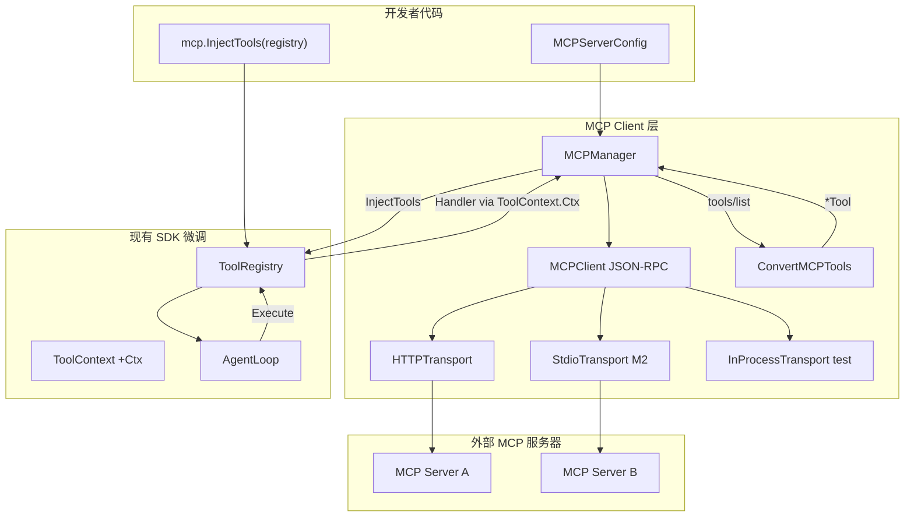

# Go SDK MCP Client — 最终执行方案 (v4)

在 v3 基础上整合最后 6 条落地建议，对齐现有代码签名。

---

## 核心决策清单（v3 不变 + v4 新增 6 项）

**v3 保持不变**：

- Transport: `Call(ctx, payload) ([]byte, error)` 请求-响应语义
- `Tool.RawJSONSchema` 只替换 `parameters` 部分
- `InjectTools` 由调用方控制，不在 `AgentLoop.Run` 中
- 连接模型：P0 每 server 单连接
- 工具命名：`mcp.{server}.{tool}`
- 过滤：通配符 AllowedTools/BlockedTools + MaxTools
- `RemoveTools` 精确移除

**v4 新增/修改**：

- **通配符匹配对象**：匹配**原始 MCP tool name**（如 `read_file`），不是注入后的 sdk name
- **HTTPTransport 非 2xx body 限制**：128KB + error 中放 BodyPreview（截断）
- **ListTools 格式判断**：用 `raw[0] == '{'` 判 object vs array，不依赖 `len(wrapped.Tools) > 0`
- **StdioTransport**：长期 reader goroutine + channel，不再每次 Call 启新 goroutine
- **InjectTools 幂等**：先 `RemoveTools` 再注入，重复调用安全
- **ToolContext 新增 Ctx**：`context.Context` 从 Handler 一路传进 `MCPManager.CallTool`

---

## 架构图




---

## Milestone 0 (半天) — 改 Tool/ToolContext 结构体

### 改动文件: [tools.go](tools.go)

**1) ToolContext 新增 Ctx 字段**（第 14-18 行）：

```go
type ToolContext struct {
    ToolName string
    CallID   string
    Extra    map[string]interface{}
    Ctx      context.Context  // 新增：传播取消/超时
}
```

这是向后兼容的改动：现有代码创建 ToolContext 时不设 Ctx，它就是 nil。MCP Handler 里检查 nil 用 `context.Background()` 兜底。

需要同步在 [agent_loop.go](agent_loop.go) 第 278 行创建 ToolContext 时传入 ctx（目前 AgentLoop.Run 没有 ctx 参数，先不改 Run 签名；用 `context.Background()` 填充即可，后续 Run 加 ctx 再改）：

```go
ctx := &ToolContext{
    ToolName: funcName,
    CallID:   tc.ID,
    Extra:    make(map[string]interface{}),
    Ctx:      context.Background(),  // 新增，后续 Run 接受 ctx 参数后替换
}
```

**2) Tool 结构体新增 RawJSONSchema**（第 34-39 行）：

```go
type Tool struct {
    Name           string
    Description    string
    Parameters     []ToolParam
    Handler        ToolHandlerFunc
    RawJSONSchema  map[string]interface{} // 原始 JSON Schema（MCP 工具用）
}
```

**3) ToJSONSchema() 优先使用 RawJSONSchema**（第 42-77 行）：

```go
func (t *Tool) ToJSONSchema() map[string]interface{} {
    if t.RawJSONSchema != nil {
        return map[string]interface{}{
            "name":        t.Name,
            "description": t.Description,
            "parameters":  t.RawJSONSchema,
        }
    }
    // 原有 ToolParam 构建逻辑完全不动...
}
```

**4) 新增 2 个测试**（追加到 [tools_test.go](tools_test.go)）：

- `TestTool_RawJSONSchema_Overrides_Parameters` — RawJSONSchema 非 nil 时替换 parameters
- `TestTool_RawJSONSchema_Nil_Fallback` — nil 时走原逻辑，现有行为不变

---

## Milestone 1 (P0, 2-3 天) — HTTP 链路跑通

### 文件 1: mcp_config.go

```go
package agentsdk

import "path"

// MCPServerConfig 定义单个 MCP 服务器的连接配置。
type MCPServerConfig struct {
    Name      string            // 唯一标识
    Transport string            // "stdio" | "http"

    // Stdio（M2）
    Command   string
    Args      []string
    Env       map[string]string

    // HTTP
    URL       string
    Headers   map[string]string

    // 通用
    Timeout    int   // 秒，默认 30
    MaxRetries int   // 默认 3，仅 5xx/网络错误/超时重试
    
    // 工具过滤（匹配原始 MCP tool name，不是注入后的 sdk name）
    // 支持通配符：read_*, list_*, dangerous_*
    AllowedTools []string  // 白名单，空=全部允许
    BlockedTools []string  // 黑名单
    MaxTools     int       // 最多注入工具数，0=不限
}

// MCPManagerConfig 管理器配置。
type MCPManagerConfig struct {
    ToolPrefix string // 命名模板，默认 "mcp.{server}.{tool}"
    TraceArgs  bool   // 是否记录 args/result 到 tracing span，默认 false
}

// matchToolFilter 匹配原始 MCP tool name（不是 sdk name）。
// 使用 path.Match 支持 * 和 ? 通配符。
func matchToolFilter(pattern, toolName string) bool {
    matched, err := path.Match(pattern, toolName)
    if err != nil {
        return false // 无效 pattern 视为不匹配
    }
    return matched
}

// isToolAllowed 综合检查一个 MCP tool name 是否通过过滤。
func isToolAllowed(name string, config *MCPServerConfig) bool {
    // 1. 黑名单优先：命中任一 blocked pattern 则拒绝
    for _, p := range config.BlockedTools {
        if matchToolFilter(p, name) {
            return false
        }
    }
    // 2. 白名单：为空=全部允许；非空=必须命中至少一个
    if len(config.AllowedTools) == 0 {
        return true
    }
    for _, p := range config.AllowedTools {
        if matchToolFilter(p, name) {
            return true
        }
    }
    return false
}
```

### 文件 2: mcp_transport.go

```go
package agentsdk

import (
    "bytes"
    "context"
    "fmt"
    "io"
    "net/http"
    "time"
)

const mcpMaxErrorBodySize = 128 * 1024 // 128KB

// MCPTransport 底层传输接口 — 请求-响应语义。
type MCPTransport interface {
    Start(ctx context.Context) error
    Call(ctx context.Context, payload []byte) ([]byte, error)
    Close() error
}

// MCPTransportError 携带 HTTP status code + body 预览。
type MCPTransportError struct {
    StatusCode  int
    BodyPreview string // 截断到 512 字符
}

func (e *MCPTransportError) Error() string {
    return fmt.Sprintf("mcp: http %d: %s", e.StatusCode, e.BodyPreview)
}

func (e *MCPTransportError) IsRetryable() bool {
    return e.StatusCode >= 500 || e.StatusCode == 429
}

// ── HTTPTransport ──

type HTTPTransport struct {
    url     string
    headers map[string]string
    timeout time.Duration
    client  *http.Client
}

func NewHTTPTransport(url string, headers map[string]string, timeout time.Duration) *HTTPTransport {
    if timeout <= 0 {
        timeout = 30 * time.Second
    }
    return &HTTPTransport{
        url:     url,
        headers: headers,
        timeout: timeout,
        client:  &http.Client{Timeout: timeout},
    }
}

func (t *HTTPTransport) Start(ctx context.Context) error { return nil }

func (t *HTTPTransport) Call(ctx context.Context, payload []byte) ([]byte, error) {
    req, err := http.NewRequestWithContext(ctx, "POST", t.url, bytes.NewReader(payload))
    if err != nil {
        return nil, fmt.Errorf("mcp: http request: %w", err)
    }
    req.Header.Set("Content-Type", "application/json")
    for k, v := range t.headers {
        req.Header.Set(k, v)
    }

    resp, err := t.client.Do(req)
    if err != nil {
        return nil, fmt.Errorf("mcp: http call: %w", err)
    }
    defer resp.Body.Close()

    if resp.StatusCode < 200 || resp.StatusCode >= 300 {
        // 读错误 body（限制 128KB）
        limited := io.LimitReader(resp.Body, mcpMaxErrorBodySize)
        body, _ := io.ReadAll(limited)
        preview := string(body)
        if len(preview) > 512 {
            preview = preview[:512] + "..."
        }
        return nil, &MCPTransportError{
            StatusCode:  resp.StatusCode,
            BodyPreview: preview,
        }
    }

    return io.ReadAll(resp.Body)
}

func (t *HTTPTransport) Close() error { return nil }

// ── InProcessTransport（测试用）──

type InProcessTransport struct {
    handler func(request []byte) ([]byte, error)
}

func NewInProcessTransport(handler func([]byte) ([]byte, error)) *InProcessTransport {
    return &InProcessTransport{handler: handler}
}

func (t *InProcessTransport) Start(ctx context.Context) error { return nil }

func (t *InProcessTransport) Call(ctx context.Context, payload []byte) ([]byte, error) {
    select {
    case <-ctx.Done():
        return nil, ctx.Err()
    default:
    }
    return t.handler(payload)
}

func (t *InProcessTransport) Close() error { return nil }
```

### 文件 3: mcp_protocol.go

```go
package agentsdk

import (
    "context"
    "encoding/json"
    "fmt"
    "sync/atomic"
)

// ── JSON-RPC 2.0 类型 ──

type jsonRPCRequest struct {
    JSONRPC string      `json:"jsonrpc"`
    ID      int64       `json:"id"`
    Method  string      `json:"method"`
    Params  interface{} `json:"params,omitempty"`
}

type jsonRPCResponse struct {
    JSONRPC string          `json:"jsonrpc"`
    ID      int64           `json:"id"`
    Result  json.RawMessage `json:"result,omitempty"`
    Error   *jsonRPCError   `json:"error,omitempty"`
}

type jsonRPCError struct {
    Code    int    `json:"code"`
    Message string `json:"message"`
}

// MCPError 统一协议层错误（携带 JSON-RPC error code）。
type MCPError struct {
    Code    int
    Message string
}

func (e *MCPError) Error() string {
    return fmt.Sprintf("mcp error %d: %s", e.Code, e.Message)
}

// ── MCP 协议类型 ──

type MCPToolDef struct {
    Name        string                 `json:"name"`
    Description string                 `json:"description"`
    InputSchema map[string]interface{} `json:"inputSchema"`
}

type MCPToolResult struct {
    Content []MCPContent `json:"content"`
    IsError bool         `json:"isError"`
}

type MCPContent struct {
    Type string `json:"type"`
    Text string `json:"text,omitempty"`
}

type MCPInitResult struct {
    ProtocolVersion string        `json:"protocolVersion"`
    ServerInfo      MCPServerInfo `json:"serverInfo"`
}

type MCPServerInfo struct {
    Name    string `json:"name"`
    Version string `json:"version"`
}

// ── MCPClient ──

type MCPClient struct {
    transport MCPTransport
    nextID    atomic.Int64
}

func NewMCPClient(transport MCPTransport) *MCPClient {
    return &MCPClient{transport: transport}
}

func (c *MCPClient) call(ctx context.Context, method string, params interface{}, result interface{}) error {
    id := c.nextID.Add(1)
    req := jsonRPCRequest{JSONRPC: "2.0", ID: id, Method: method, Params: params}
    payload, err := json.Marshal(req)
    if err != nil {
        return fmt.Errorf("mcp: marshal request: %w", err)
    }

    respBytes, err := c.transport.Call(ctx, payload)
    if err != nil {
        return err
    }

    var resp jsonRPCResponse
    if err := json.Unmarshal(respBytes, &resp); err != nil {
        return fmt.Errorf("mcp: unmarshal response: %w", err)
    }

    if resp.Error != nil {
        return &MCPError{Code: resp.Error.Code, Message: resp.Error.Message}
    }

    if result != nil && resp.Result != nil {
        if err := json.Unmarshal(resp.Result, result); err != nil {
            return fmt.Errorf("mcp: unmarshal result: %w", err)
        }
    }
    return nil
}

func (c *MCPClient) Initialize(ctx context.Context) (*MCPInitResult, error) {
    params := map[string]interface{}{
        "protocolVersion": "2024-11-05",
        "capabilities":    map[string]interface{}{},
        "clientInfo": map[string]string{
            "name":    "zapry-agents-sdk-go",
            "version": "1.0.0",
        },
    }
    var result MCPInitResult
    if err := c.call(ctx, "initialize", params, &result); err != nil {
        return nil, err
    }
    return &result, nil
}

// ListTools 兼容两种返回格式：{tools:[...]} 和 裸 [...]。
// 用 raw[0] 判断是 object 还是 array，避免空数组误判。
func (c *MCPClient) ListTools(ctx context.Context) ([]MCPToolDef, error) {
    var raw json.RawMessage
    if err := c.call(ctx, "tools/list", nil, &raw); err != nil {
        return nil, err
    }

    trimmed := bytes.TrimSpace(raw)
    if len(trimmed) == 0 {
        return nil, fmt.Errorf("mcp: empty tools/list response")
    }

    if trimmed[0] == '{' {
        // Object 格式：{"tools": [...]}
        var wrapped struct {
            Tools []MCPToolDef `json:"tools"`
        }
        if err := json.Unmarshal(trimmed, &wrapped); err != nil {
            return nil, fmt.Errorf("mcp: unmarshal tools/list object: %w", err)
        }
        return wrapped.Tools, nil
    }

    if trimmed[0] == '[' {
        // Array 格式：[...]
        var tools []MCPToolDef
        if err := json.Unmarshal(trimmed, &tools); err != nil {
            return nil, fmt.Errorf("mcp: unmarshal tools/list array: %w", err)
        }
        return tools, nil
    }

    return nil, fmt.Errorf("mcp: unexpected tools/list result format")
}

func (c *MCPClient) CallTool(ctx context.Context, name string, args map[string]interface{}) (*MCPToolResult, error) {
    params := map[string]interface{}{
        "name":      name,
        "arguments": args,
    }
    var result MCPToolResult
    if err := c.call(ctx, "tools/call", params, &result); err != nil {
        return nil, err
    }
    return &result, nil
}

func (c *MCPClient) Close() error {
    return c.transport.Close()
}
```

注意：需要在文件顶部 import 中加入 `"bytes"`。

### 文件 4: mcp_converter.go

```go
package agentsdk

import (
    "context"
    "fmt"
    "strings"
)

// mcpCallResult 携带规范化文本 + 原始结果（tracing 用）。
type mcpCallResult struct {
    Text string
    Raw  *MCPToolResult
}

func mcpResultToCallResult(result *MCPToolResult) *mcpCallResult {
    var sb strings.Builder
    for _, c := range result.Content {
        if c.Type == "text" && c.Text != "" {
            if sb.Len() > 0 {
                sb.WriteString("\n")
            }
            sb.WriteString(c.Text)
        }
    }
    text := sb.String()
    if result.IsError {
        text = "Error: " + text
    }
    return &mcpCallResult{Text: text, Raw: result}
}

// mcpToolName 生成注入后的 SDK 工具名。
func mcpToolName(server, tool string) string {
    return "mcp." + server + "." + tool
}

// extractToolParams 从 inputSchema 提取顶层 ToolParam（基础校验用）。
func extractToolParams(inputSchema map[string]interface{}) []ToolParam {
    if inputSchema == nil {
        return nil
    }
    propsRaw, ok := inputSchema["properties"]
    if !ok {
        return nil
    }
    props, ok := propsRaw.(map[string]interface{})
    if !ok {
        return nil
    }

    // 收集 required 列表
    requiredSet := map[string]bool{}
    if reqRaw, ok := inputSchema["required"]; ok {
        if reqArr, ok := reqRaw.([]interface{}); ok {
            for _, r := range reqArr {
                if s, ok := r.(string); ok {
                    requiredSet[s] = true
                }
            }
        }
    }

    var params []ToolParam
    for name, propRaw := range props {
        prop, ok := propRaw.(map[string]interface{})
        if !ok {
            continue
        }
        p := ToolParam{
            Name:     name,
            Required: requiredSet[name],
        }
        if t, ok := prop["type"].(string); ok {
            p.Type = t
        }
        if d, ok := prop["description"].(string); ok {
            p.Description = d
        }
        params = append(params, p)
    }
    return params
}

// ConvertMCPTools 将 MCP 工具转为 SDK *Tool。
//
// 设计要点：
// 1. 通配符过滤匹配原始 MCP tool name（不是 sdk name）
// 2. RawJSONSchema 存 inputSchema 原始 map
// 3. Handler 闭包通过 ToolContext.Ctx 传播 context
// 4. MaxTools 截断
func ConvertMCPTools(
    serverName string,
    mcpTools []MCPToolDef,
    callFn func(ctx context.Context, toolName string, args map[string]interface{}) (interface{}, error),
    config *MCPServerConfig,
) []*Tool {
    var tools []*Tool

    for _, mt := range mcpTools {
        // 通配符过滤：匹配原始 MCP tool name
        if config != nil && !isToolAllowed(mt.Name, config) {
            continue
        }

        originalName := mt.Name
        sdkName := mcpToolName(serverName, originalName)

        // Handler：通过 ToolContext.Ctx 传播 context
        handler := func(ctx *ToolContext, args map[string]interface{}) (interface{}, error) {
            callCtx := context.Background()
            if ctx != nil && ctx.Ctx != nil {
                callCtx = ctx.Ctx
            }
            return callFn(callCtx, originalName, args)
        }

        tool := &Tool{
            Name:          sdkName,
            Description:   fmt.Sprintf("[MCP:%s] %s", serverName, mt.Description),
            Parameters:    extractToolParams(mt.InputSchema),
            RawJSONSchema: mt.InputSchema,
            Handler:       handler,
        }
        tools = append(tools, tool)

        // MaxTools 截断
        if config != nil && config.MaxTools > 0 && len(tools) >= config.MaxTools {
            break
        }
    }

    return tools
}
```

### 文件 5: mcp_manager.go

```go
package agentsdk

import (
    "context"
    "errors"
    "fmt"
    "log"
    "math"
    "strings"
    "sync"
    "time"
)

type mcpServerConn struct {
    config   MCPServerConfig
    client   *MCPClient
    mcpTools []MCPToolDef
    sdkTools []*Tool
}

// MCPManager 管理多个 MCP 服务器连接，将 MCP 工具注入 ToolRegistry。
type MCPManager struct {
    mu            sync.RWMutex
    servers       map[string]*mcpServerConn
    config        MCPManagerConfig
    toolMap       map[string]string // sdkToolName -> serverName
    injectedTools []string          // 精确移除用
}

func NewMCPManager(config ...MCPManagerConfig) *MCPManager {
    cfg := MCPManagerConfig{}
    if len(config) > 0 {
        cfg = config[0]
    }
    if cfg.ToolPrefix == "" {
        cfg.ToolPrefix = "mcp.{server}.{tool}"
    }
    return &MCPManager{
        servers: make(map[string]*mcpServerConn),
        config:  cfg,
        toolMap: make(map[string]string),
    }
}

// AddServer 连接 MCP 服务器：transport.Start → Initialize → ListTools → Convert。
func (m *MCPManager) AddServer(ctx context.Context, config MCPServerConfig) error {
    if config.Timeout <= 0 {
        config.Timeout = 30
    }
    if config.MaxRetries <= 0 {
        config.MaxRetries = 3
    }
    timeout := time.Duration(config.Timeout) * time.Second

    // 创建 transport
    var transport MCPTransport
    switch config.Transport {
    case "http":
        transport = NewHTTPTransport(config.URL, config.Headers, timeout)
    case "stdio":
        // M2 实现
        return fmt.Errorf("mcp: stdio transport not yet implemented")
    default:
        return fmt.Errorf("mcp: unsupported transport: %q", config.Transport)
    }

    if err := transport.Start(ctx); err != nil {
        return fmt.Errorf("mcp: start transport: %w", err)
    }

    client := NewMCPClient(transport)

    // Initialize
    if _, err := client.Initialize(ctx); err != nil {
        transport.Close()
        return fmt.Errorf("mcp: initialize %q: %w", config.Name, err)
    }

    // ListTools
    mcpTools, err := client.ListTools(ctx)
    if err != nil {
        transport.Close()
        return fmt.Errorf("mcp: list tools %q: %w", config.Name, err)
    }

    // Convert
    callFn := func(callCtx context.Context, toolName string, args map[string]interface{}) (interface{}, error) {
        return m.callToolDirect(callCtx, config.Name, toolName, args, config.MaxRetries)
    }
    sdkTools := ConvertMCPTools(config.Name, mcpTools, callFn, &config)

    // Store
    m.mu.Lock()
    defer m.mu.Unlock()

    conn := &mcpServerConn{
        config:   config,
        client:   client,
        mcpTools: mcpTools,
        sdkTools: sdkTools,
    }
    m.servers[config.Name] = conn

    for _, t := range sdkTools {
        m.toolMap[t.Name] = config.Name
    }

    log.Printf("[MCPManager] Added server %q with %d tools", config.Name, len(sdkTools))
    return nil
}

// RemoveServer 断开并清理指定服务器。
func (m *MCPManager) RemoveServer(name string) error {
    m.mu.Lock()
    defer m.mu.Unlock()

    conn, ok := m.servers[name]
    if !ok {
        return fmt.Errorf("mcp: server %q not found", name)
    }

    // 清理 toolMap
    for _, t := range conn.sdkTools {
        delete(m.toolMap, t.Name)
    }

    // 关闭连接
    err := conn.client.Close()
    delete(m.servers, name)
    return err
}

// InjectTools 将 MCP 工具注入 ToolRegistry（幂等：先移除旧的再注入）。
func (m *MCPManager) InjectTools(registry *ToolRegistry) {
    m.mu.Lock()
    defer m.mu.Unlock()

    // 先移除之前注入的（幂等）
    for _, name := range m.injectedTools {
        registry.Remove(name)
    }
    m.injectedTools = nil

    // 注入当前所有 MCP 工具
    for _, conn := range m.servers {
        for _, tool := range conn.sdkTools {
            registry.Register(tool)
            m.injectedTools = append(m.injectedTools, tool.Name)
        }
    }
}

// RemoveTools 精确移除 MCP 注入的工具（不影响用户同名工具）。
func (m *MCPManager) RemoveTools(registry *ToolRegistry) {
    m.mu.Lock()
    defer m.mu.Unlock()

    for _, name := range m.injectedTools {
        registry.Remove(name)
    }
    m.injectedTools = nil
}

// CallTool 由注入的 Tool Handler 闭包调用，根据 sdk name 路由到正确 server。
func (m *MCPManager) CallTool(ctx context.Context, sdkToolName string, args map[string]interface{}) (interface{}, error) {
    m.mu.RLock()
    serverName, ok := m.toolMap[sdkToolName]
    if !ok {
        m.mu.RUnlock()
        return nil, fmt.Errorf("mcp: tool %q not found", sdkToolName)
    }
    conn, ok := m.servers[serverName]
    if !ok {
        m.mu.RUnlock()
        return nil, fmt.Errorf("mcp: server %q not found", serverName)
    }
    maxRetries := conn.config.MaxRetries
    m.mu.RUnlock()

    // 还原原始 MCP tool name
    prefix := "mcp." + serverName + "."
    originalName := strings.TrimPrefix(sdkToolName, prefix)

    return m.callToolDirect(ctx, serverName, originalName, args, maxRetries)
}

// callToolDirect 直接调用指定 server 的工具（含重试逻辑）。
func (m *MCPManager) callToolDirect(ctx context.Context, serverName, toolName string, args map[string]interface{}, maxRetries int) (interface{}, error) {
    m.mu.RLock()
    conn, ok := m.servers[serverName]
    m.mu.RUnlock()
    if !ok {
        return nil, fmt.Errorf("mcp: server %q not found", serverName)
    }

    var lastErr error
    for attempt := 0; attempt <= maxRetries; attempt++ {
        if attempt > 0 {
            // 指数退避：100ms * 2^(attempt-1)
            backoff := time.Duration(math.Pow(2, float64(attempt-1))) * 100 * time.Millisecond
            select {
            case <-ctx.Done():
                return nil, ctx.Err()
            case <-time.After(backoff):
            }
        }

        result, err := conn.client.CallTool(ctx, toolName, args)
        if err != nil {
            lastErr = err
            // 仅对可重试错误继续
            var transportErr *MCPTransportError
            if errors.As(err, &transportErr) && transportErr.IsRetryable() {
                continue
            }
            return nil, err // 不可重试，立即返回
        }

        // 成功：规范化结果
        cr := mcpResultToCallResult(result)
        return cr.Text, nil
    }

    return nil, fmt.Errorf("mcp: call %s.%s failed after %d retries: %w", serverName, toolName, maxRetries, lastErr)
}

// RefreshTools 重新发现指定（或全部）服务器的工具。
func (m *MCPManager) RefreshTools(ctx context.Context, server ...string) error {
    m.mu.Lock()
    defer m.mu.Unlock()

    targets := server
    if len(targets) == 0 {
        for name := range m.servers {
            targets = append(targets, name)
        }
    }

    for _, name := range targets {
        conn, ok := m.servers[name]
        if !ok {
            continue
        }

        // 清理旧 toolMap
        for _, t := range conn.sdkTools {
            delete(m.toolMap, t.Name)
        }

        // 重新 ListTools
        mcpTools, err := conn.client.ListTools(ctx)
        if err != nil {
            return fmt.Errorf("mcp: refresh %q: %w", name, err)
        }

        callFn := func(callCtx context.Context, toolName string, args map[string]interface{}) (interface{}, error) {
            return m.callToolDirect(callCtx, name, toolName, args, conn.config.MaxRetries)
        }
        sdkTools := ConvertMCPTools(name, mcpTools, callFn, &conn.config)

        conn.mcpTools = mcpTools
        conn.sdkTools = sdkTools

        for _, t := range sdkTools {
            m.toolMap[t.Name] = name
        }
    }

    return nil
}

// DisconnectAll 断开所有服务器。
func (m *MCPManager) DisconnectAll() error {
    m.mu.Lock()
    defer m.mu.Unlock()

    var errs []string
    for name, conn := range m.servers {
        if err := conn.client.Close(); err != nil {
            errs = append(errs, fmt.Sprintf("%s: %v", name, err))
        }
    }
    m.servers = make(map[string]*mcpServerConn)
    m.toolMap = make(map[string]string)
    m.injectedTools = nil

    if len(errs) > 0 {
        return fmt.Errorf("mcp: disconnect errors: %s", strings.Join(errs, "; "))
    }
    return nil
}

// ListTools 返回所有（或指定服务器的）已转换工具。
func (m *MCPManager) ListTools(server ...string) []*Tool {
    m.mu.RLock()
    defer m.mu.RUnlock()

    var result []*Tool
    if len(server) == 0 {
        for _, conn := range m.servers {
            result = append(result, conn.sdkTools...)
        }
    } else {
        for _, name := range server {
            if conn, ok := m.servers[name]; ok {
                result = append(result, conn.sdkTools...)
            }
        }
    }
    return result
}

// ServerNames 返回已连接的服务器名。
func (m *MCPManager) ServerNames() []string {
    m.mu.RLock()
    defer m.mu.RUnlock()
    names := make([]string, 0, len(m.servers))
    for n := range m.servers {
        names = append(names, n)
    }
    return names
}
```

---

## Milestone 2 (P1, 2-3 天) — StdioTransport

### 长期 reader goroutine + channel 架构

```go
type StdioTransport struct {
    command string
    args    []string
    env     map[string]string
    timeout time.Duration

    cmd    *exec.Cmd
    stdin  io.WriteCloser
    lines  chan []byte       // reader goroutine 持续写入
    errc   chan error        // reader goroutine 错误
    done   chan struct{}     // 进程退出信号
    mu     sync.Mutex        // 串行化写请求
}

func (t *StdioTransport) Start(ctx context.Context) error {
    // 1. exec.CommandContext 启动子进程
    // 2. 获取 stdin/stdout/stderr pipe
    // 3. 启动 stderr 消费 goroutine（log.Printf，不参与 JSON）
    // 4. 启动长期 reader goroutine：
    //    reader := bufio.NewReaderSize(stdout, 1024*1024)  // 1MB buffer
    //    for {
    //        line, err := reader.ReadBytes('\n')
    //        if err != nil { errc <- err; return }
    //        lines <- bytes.TrimSpace(line)
    //    }
    // 5. 启动进程监听 goroutine：cmd.Wait() → close(done)
}

func (t *StdioTransport) Call(ctx context.Context, payload []byte) ([]byte, error) {
    t.mu.Lock()
    defer t.mu.Unlock()

    // 检查进程存活
    select {
    case <-t.done:
        return nil, fmt.Errorf("mcp: stdio process exited")
    default:
    }

    // 写请求
    if _, err := t.stdin.Write(append(payload, '\n')); err != nil {
        return nil, fmt.Errorf("mcp: stdio write: %w", err)
    }

    // 从 channel 收一行（不启新 goroutine，不泄漏）
    select {
    case line := <-t.lines:
        return line, nil
    case err := <-t.errc:
        return nil, fmt.Errorf("mcp: stdio read: %w", err)
    case <-ctx.Done():
        return nil, ctx.Err()
    case <-t.done:
        return nil, fmt.Errorf("mcp: stdio process exited during read")
    }
}

func (t *StdioTransport) Close() error {
    // 1. stdin.Close()
    // 2. select { case <-done: ok / case <-time.After(5s): cmd.Process.Kill() }
    // 3. cmd.Wait()
}
```

**优势**：reader goroutine 只有一个，与进程生命周期绑定；Cancel 不会导致 goroutine 积累。

---

## Milestone 3 — README

- MCP Client 概述
- 快速开始（HTTP + Stdio 示例）
- MCPServerConfig 全字段说明
- **工具过滤**：明确说明匹配对象是原始 MCP tool name
- **注入幂等**：明确说明重复 InjectTools 安全
- StdioTransport 约定（一行一个 JSON、stderr 行为）
- 与 AgentLoop 集成示例
- Tracing 集成

---

## 测试矩阵 (~36 用例)

### M0: tools.go (2)

- `TestTool_RawJSONSchema_Overrides_Parameters`
- `TestTool_RawJSONSchema_Nil_Fallback`

### M1: 协议层 (8)

- `TestJSONRPCRequest_Marshal`
- `TestJSONRPCResponse_Unmarshal`
- `TestJSONRPCResponse_Error` — MCPError 带 code
- `TestMCPClient_Initialize`
- `TestMCPClient_ListTools_WrappedFormat` — `{tools:[...]}`
- `TestMCPClient_ListTools_BareArray` — `[...]`
- `TestMCPClient_ListTools_EmptyArray` — 空数组不误判
- `TestMCPClient_CallTool_Success`

### M1: 转换层 (8)

- `TestConvertMCPTools_Basic`
- `TestConvertMCPTools_RawSchemaPreserved`
- `TestConvertMCPTools_ExtractParams`
- `TestConvertMCPTools_Required`
- `TestConvertMCPTools_AllowedFilter` — 匹配原始 MCP tool name
- `TestConvertMCPTools_BlockedFilter`
- `TestConvertMCPTools_MaxTools`
- `TestMCPResultToCallResult` — text + raw 保留

### M1: MCPManager (11)

- `TestMCPManager_AddServer`
- `TestMCPManager_RemoveServer`
- `TestMCPManager_InjectTools`
- `TestMCPManager_InjectTools_Idempotent` — 重复注入安全
- `TestMCPManager_RemoveTools_Precise` — 不删用户同名工具
- `TestMCPManager_CallTool_E2E`
- `TestMCPManager_MultiServer`
- `TestMCPManager_ToolNameConflict`
- `TestMCPManager_RefreshTools`
- `TestMCPManager_DisconnectAll`
- `TestMCPManager_ServerNotFound`

### M1: 集成测试 (7)

- `TestAgentLoop_MCPTool_Selected`
- `TestAgentLoop_MixedTools`
- `TestMCPManager_CallTool_Timeout`
- `TestMCPManager_CallTool_Cancel`
- `TestMCPManager_CallTool_Retry` — 5xx 重试成功
- `TestMatchToolFilter_Wildcard` — table-driven
- `TestHTTPTransport_NonOK_StatusCode` — 128KB body preview

### M2: Stdio 专项 (6)

- `TestStdioTransport_Call`
- `TestStdioTransport_ProcessExit`
- `TestStdioTransport_StartupTimeout`
- `TestStdioTransport_StderrNoise`
- `TestStdioTransport_LargeResponse` — 超 64K
- `TestStdioTransport_CancelNoLeak` — cancel 不泄漏 goroutine

---

## 开发者使用示例

```go
ctx := context.Background()

mcp := agentsdk.NewMCPManager()

_ = mcp.AddServer(ctx, agentsdk.MCPServerConfig{
    Name:         "filesystem",
    Transport:    "stdio",
    Command:      "npx",
    Args:         []string{"-y", "@modelcontextprotocol/server-filesystem", "/tmp"},
    AllowedTools: []string{"read_file", "list_*"},  // 匹配原始 MCP tool name
    MaxTools:     10,
})

_ = mcp.AddServer(ctx, agentsdk.MCPServerConfig{
    Name:      "search",
    Transport: "http",
    URL:       "https://mcp.example.com/search",
    Headers:   map[string]string{"Authorization": "Bearer xxx"},
    Timeout:   15,
})

registry := agentsdk.NewToolRegistry()
registry.Register(myLocalTool)
mcp.InjectTools(registry)  // 幂等：可重复调用

loop := agentsdk.NewAgentLoop(myLLM, registry, "You are helpful.", 10, nil)
result := loop.Run("读取 /tmp/data.txt", nil, "")

defer mcp.DisconnectAll()
```

